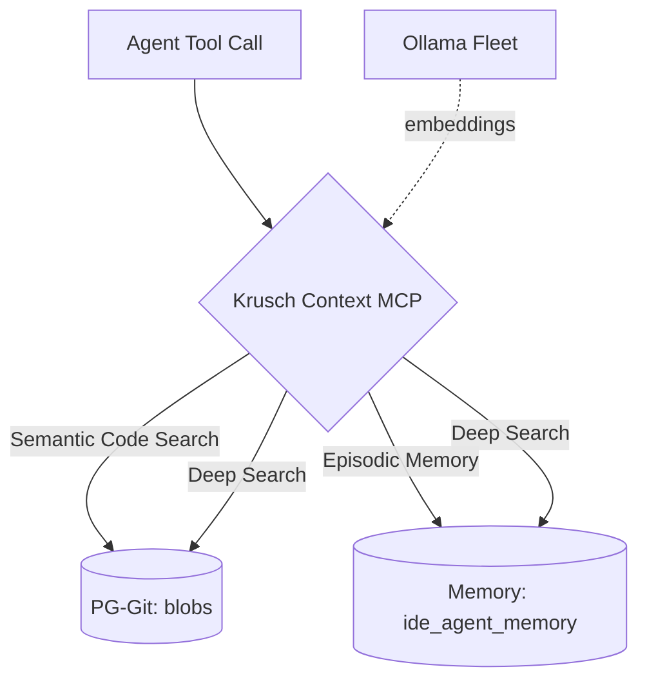

<p align="center">
  
</p>

<p align="center">
  <strong>Unified IDE context engine that merges semantic codebase search with episodic project memory into a single MCP server.</strong>
</p>

<p align="center">
  <a href="https://github.com/kruschdev/krusch-context-mcp"></a>
  <a href="https://github.com/kruschdev/krusch-context-mcp/blob/main/LICENSE"></a>
  
  
  
</p>

---

## ⚡ Why Krusch Context MCP?

Previously, each IDE agent session needed two separate MCP servers (`pg-git-mcp` + `krusch-memory-mcp`), each with its own Node.js process, PostgreSQL pool, and Ollama connection. This unified server collapses them into a single process and introduces **Zero-Trust Context** — the philosophy that an AI agent must *verify* its understanding of your codebase before acting, never assuming stale context is current.

### Key Features
- **💾 Shared Connection Pool:** A single `pg.Pool` connected to `kruschdb`, eliminating duplicate database connections.
- **🧠 Shared Embeddings:** Shared Ollama embedding logic with fleet-wide round-robin load balancing across multiple GPU nodes.
- **🔍 Zero-Trust Context:** The `krusch_context_deep_search` tool queries both codebase (objective) and memory (subjective) in one call, giving agents a holistic reality check.
- **📌 Soft Project Separation:** Memories are tagged by `project`, with dynamic relevance boosting for the agent's active project — preventing cross-project hallucinations.
- **🏷️ Auto-Tagging:** Memories are automatically tagged with keywords via `llama3.2`, making them discoverable without manual effort.
- **♻️ Memory Consolidation:** Semantic deduplication detects and merges overlapping memories to prevent context bloat.

---

## 🧠 Architecture: Zero-Trust Context Engine

The server acts as a unified facade over two distinct PostgreSQL schemas in `kruschdb`:



| Component | Details |
|-----------|---------|
| **Database** | PostgreSQL + pgvector (`kruschdb` on `kruschserv:5434`) |
| **Embeddings** | Ollama `qwen2.5-coder:1.5b` @ 1536 dims, fleet load-balanced |
| **Tagging** | Ollama `llama3.2` for automatic keyword extraction |
| **Tables** | `blobs` (6,500+ indexed codebase files), `ide_agent_memory` (episodic) |
| **Protocol** | MCP Stdio transport |
| **Temporal Decay** | Exponential decay rate of 0.01 — a memory's relevance drops ~26% after 30 days of inactivity |

---

## 📦 Quick Start

**Prerequisites:**
- [Node.js](https://nodejs.org/) 18+
- [Ollama](https://ollama.com/) running with `qwen2.5-coder:1.5b` and `llama3.2` models
- PostgreSQL with `pgvector` extension
- The sibling `pg-git` project with a configured `.env`

**1. Install dependencies:**
```bash
cd projects/krusch-context-mcp
npm install
```

**2. Start the server:**
```bash
npm start
```

**3. Add to your IDE MCP settings** (e.g., `claude_desktop_config.json`, `.cursor/mcp.json`, or Antigravity config):
```json
{
  "mcpServers": {
    "krusch-context-mcp": {
      "command": "node",
      "args": ["/path/to/krusch-context-mcp/src/index.js"]
    }
  }
}
```

**4. Restart your IDE.** That's it — your agent now has access to all 11 tools.

---

## 🚀 Real-World Usage Examples

To effectively use Krusch Context MCP, simply instruct your IDE agent to document its findings or query its memory.

**Example 1: Documenting a bug fix**
> **You:** "That fixed the port conflict! Save this to memory so we don't forget the fix."
> **Agent:** *[Calls `krusch_context_add_memory`]* "Saved a memory in the 'bugs' category noting that port 5441 conflicts with the legacy DB and we should use 5442 instead."

**Example 2: Recalling architectural decisions**
> **You:** "How did we decide to structure the auth system?"
> **Agent:** *[Calls `krusch_context_search_memory`]* "According to the 'lessons' category, we chose a singleton JWT factory to avoid circular dependencies."

**Example 3: Zero-Trust Context check**
> **You:** "Before we start, verify what you know about the database schema."
> **Agent:** *[Calls `krusch_context_deep_search`]* "Cross-referencing codebase search (blobs) with episodic memory — the schema uses pgvector with 1536 dims, and our last session noted we added the `tags` column."

**Example 4: Memory Consolidation**
> **You:** "Clean up the repetitive notes about the migration."
> **Agent:** *[Calls `krusch_context_consolidate`]* "Found 4 overlapping memories, consolidated into 2 clean records."

**Example 5: Browsing indexed code**
> **You:** "Show me the file tree for the krusch-context-mcp repo."
> **Agent:** *[Calls `krusch_context_read_tree`]* "Here's the indexed tree: `src/index.js`, `src/memory-engine.js`, `package.json`..."

---

## 🤖 The Autonomous Agent Workflow (`/close` & `/continue`)

Krusch Context MCP is designed for **infinite session continuity** — your agent never starts from zero.

### 1. The `/close` Workflow (Pause Work)
When stepping away, tell your agent `/close`. It will:
1. **Save Local State:** Write active files, fragile components, and next steps to `GEMINI_INFLIGHT.md`.
2. **Commit to Long-Term Memory:** Call `krusch_context_add_memory` to embed the session's decisions, outcomes, and bug fixes into the vector database.

### 2. The `/continue` Workflow (Resume Work)
When starting a new session, type `/continue`. The agent will:
1. **Read Local State:** Load `GEMINI_INFLIGHT.md` for the active task list.
2. **Retrieve Semantic Context:** Call `krusch_context_search_memory` to dynamically load relevant historical context.
3. **Verify Codebase State:** Call `krusch_context_search_code` to confirm its understanding of the current implementation matches reality.

**The Result:** The agent dynamically pulls the exact context it needs, giving it infinite continuity across sessions without hallucinating stale state.

---

## 🛠️ Available Tools

| Tool | Description |
|------|-------------|
| `krusch_context_add_memory` | Store an episodic memory (bug, lesson, priority, outcome, activity) |
| `krusch_context_search_memory` | Semantic search over episodic memories with temporal decay |
| `krusch_context_list_memories` | List recent memories by category (no embedding, fast) |
| `krusch_context_delete_memory` | Delete a memory by ID |
| `krusch_context_update_memory` | Update content/tags/project (re-embeds on content change) |
| `krusch_context_consolidate` | Find and merge semantically duplicate memories |
| `krusch_context_search_code` | Semantic search over all indexed codebase files |
| `krusch_context_list_repos` | List all repositories indexed in PG-Git |
| `krusch_context_read_tree` | Browse the file tree of an indexed repository |
| `krusch_context_read_blob` | Read full content of a specific file by blob ID |
| `krusch_context_deep_search` | Composite zero-trust search across both memory and codebase |

---

## 🤝 The Agentic Brain (Synergy with PG-Git)

Krusch Context MCP unifies two complementary halves of the **Agentic Brain**:

- **Episodic Memory (The "Why")**: The `ide_agent_memory` table stores *intent* — architectural decisions, user preferences, bugs encountered, and project goals. Powered by exponential temporal decay so the agent always prefers fresh context.
- **Codebase Memory (The "What" & "How")**: The `blobs` table stores *implementation* — 6,500+ embedded files across 28+ repositories, providing the actual code, file structures, and algorithms.

By querying both simultaneously via `krusch_context_deep_search`, the agent can cross-reference *why* you chose a specific architecture with *how* it's currently implemented.

---

## ⚙️ Configuration

Krusch Context MCP inherits its configuration from the sibling `pg-git/.env` file. It does **not** have its own `.env`.

| Variable | Description | Default |
|----------|-------------|---------| 
| `PG_CONNECTION_STRING` | PostgreSQL connection string for `kruschdb` | *(required, from pg-git)* |
| `OLLAMA_URL` | Ollama endpoint for embeddings | `http://localhost:11434` |
| `EMBED_MODEL` | Ollama embedding model | `qwen2.5-coder:1.5b` |
| `DECAY_RATE` | Exponential decay rate for temporal memory scoring | `0.01` |
| `AUTO_TAG` | Auto-generate keyword tags on new memories | `true` (hardcoded) |
| `TAG_MODEL` | Ollama model for tag extraction | `llama3.2` |

### Troubleshooting

- **Ollama API returned 404**
  *Cause:* Embedding model not pulled.
  *Fix:* Run `ollama pull qwen2.5-coder:1.5b` and `ollama pull llama3.2`.

- **ECONNREFUSED on Ollama URL**
  *Cause:* Ollama is not running.
  *Fix:* Start Ollama with `ollama serve`, or verify fleet node availability.

- **FATAL: Cannot reach PostgreSQL**
  *Cause:* `kruschdb` is unreachable or `pg-git/.env` is misconfigured.
  *Fix:* Verify `PG_CONNECTION_STRING` in `../pg-git/.env` and ensure `kruschserv:5434` is accessible.

- **Column "project" does not exist**
  *Cause:* The `ide_agent_memory` table predates the schema migration.
  *Fix:* The server runs idempotent `ALTER TABLE` migrations on startup. Simply restart.

---

## 🧪 Testing

```bash
node test_client.js
```

This script connects to the live `kruschdb` instance and verifies registration and execution of all 11 tools.

---

## 🗺️ Related Projects

| Project | Role |
|---------|------|
| [PG-Git](https://github.com/kruschdev/pg-git) | Semantic codebase search engine (sibling dependency) |
| [Krusch Memory MCP](https://github.com/kruschdev/krusch-memory-mcp) | Legacy standalone episodic memory (superseded by this project) |
| [Krusch Sequential MCP](https://github.com/kruschdev/krusch-sequential-mcp) | Sequential thinking with PG persistence |
| [Krusch Cascade Router](https://github.com/kruschdev/krusch-cascade-router) | Automated LLM inference routing and gateway |

---

## 🤝 Contributing

We welcome contributions! Please ensure your tests pass and adhere to the project formatting standards.

## 📄 License

MIT License © 2026 [kruschdev](https://github.com/kruschdev)
