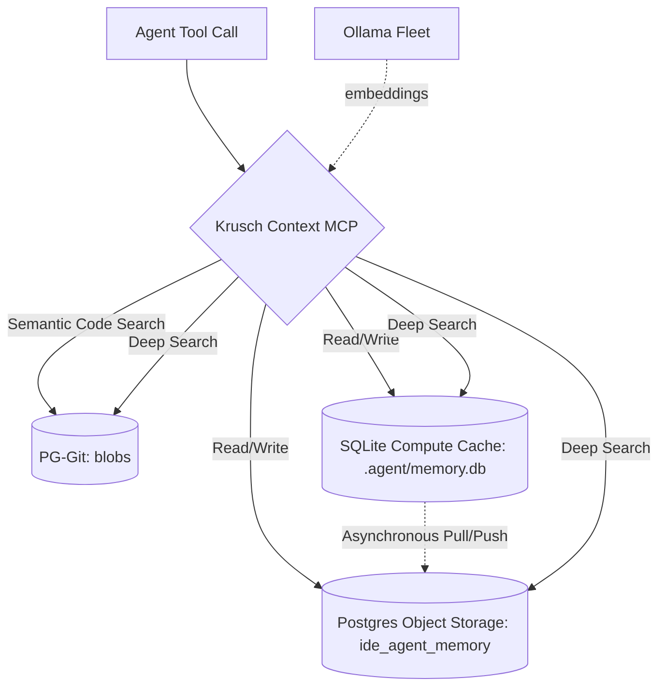

<p align="center">
  
</p>

<p align="center">
  <strong>Unified IDE context engine that merges semantic codebase search with episodic project memory into a single MCP server.</strong>
</p>

[](https://github.com/kruschdev/krusch-context-mcp)
[](https://opensource.org/licenses/MIT)


---

## The Problem

Every time you start a new AI coding session, your agent starts from zero. It doesn't remember the bug you fixed yesterday, the architectural decision you made last week, or even what files exist in your project. You end up re-explaining context, watching it hallucinate stale assumptions, and losing momentum to the "goldfish memory" problem.

**Krusch Context MCP fixes this.** It gives your AI coding agent persistent, searchable memory across every session — and pairs it with semantic search over your entire codebase — so your agent always knows *what* your code does, *why* you built it that way, and *what went wrong last time*.

## What It Does

Krusch Context MCP is a single [Model Context Protocol](https://modelcontextprotocol.io/) server that exposes 18 tools to any MCP-compatible IDE agent (Cursor, Claude Code, Windsurf, Gemini CLI, etc.):

- **🔍 Semantic Codebase Search** — Your agent can search the *meaning* of your code, not just filenames. "How do we handle auth?" returns the actual implementation across all your repos.
- **🧠 Episodic Memory** — Bugs found, decisions made, lessons learned, and priorities set are stored as vector-embedded memories that persist across sessions and are retrieved by semantic relevance with temporal decay.
- **💎 Steering Nudges** — Lightweight key-value facts (preferences, conventions, corrections) that give the agent behavioral continuity without re-prompting.
- **📖 Documentation Search** — Ingested external manuals (framework docs, API references) are searchable locally, so your agent references *your* versions, not its training data.
- **🌍 Zero-Trust Deep Search** — A single tool call that cross-references codebase reality with historical memory, so the agent *verifies* what it knows before acting.

The result: your agent picks up exactly where you left off, every time, without you explaining a thing.

## Why You'd Want It

### 🛡️ Your Context Lives On Your Metal

All embeddings are generated locally via [Ollama](https://ollama.com/) (`bge-large` for vectors, `llama3.2` for tagging). All storage is local PostgreSQL + pgvector + SQLite. Nothing leaves your machine.

- **Zero API costs** for context retrieval — you aren't paying per-token to search your own code
- **Full data sovereignty** — proprietary code, architecture decisions, and bug reports stay on your hardware
- **No provider lock-in** — your context infrastructure works regardless of which LLM provider you're using today

### 🔄 Switch Models Without Losing Your Mind

Because memory and codebase context are decoupled from the reasoning engine, you can swap your IDE agent mid-project and the new model inherits everything:

- Start your morning with **Gemini** for planning
- Switch to **Claude** for precise refactoring
- Pivot to **GPT-4o** for exploring a new API
- Fall back to a **local model** when your internet drops

Every model gets the same memories, the same codebase search, the same nudges. Your project history outlives any individual chat session or provider context window.

### ⚡ One Server, Not Three

This used to require running separate MCP servers for memory, codebase search, and nuggets — each with its own Node.js process and database connections. Krusch Context MCP collapses all of it into a single process with a shared connection pool and embedding pipeline.

### Key Capabilities

- **💾 Shared Connection Pool** — Single `pg.Pool` to `kruschdb`, no duplicate connections
- **🧠 Fleet-Balanced Embeddings** — Round-robin load balancing across multiple Ollama GPU nodes
- **📌 Lakebase Architecture** — Inspired by [Neon's decoupled architecture](https://neon.com/docs/introduction/architecture-overview): local SQLite caches for zero-latency reads, async write-behind to durable PostgreSQL storage
- **🏷️ Auto-Tagging** — Memories are automatically tagged via `llama3.2` for discoverability
- **♻️ Memory Consolidation** — Semantic dedup using L2-normalized centroid averaging without re-embedding. *Derived from [Geometry of Consolidation](https://github.com/niashwin/geometry-of-consolidation).*
- **💎 Holographic Nuggets** — Lightweight steering facts split between project-local SQLite and global PostgreSQL. *Adapted from [NeoVertex1/nuggets](https://github.com/NeoVertex1/nuggets).*

---

## 🧠 Architecture: Hybrid Zero-Trust Context Engine

The server acts as a unified facade over local SQLite databases and PostgreSQL schemas in `kruschdb`:



| Component | Details |
|-----------|---------|
| **Database** | Hybrid: Local SQLite (Project Memories) + PostgreSQL (Global & Codebase) |
| **Embeddings** | Ollama `bge-large` @ 1024 dims, fleet load-balanced |
| **Tagging** | Ollama `llama3.2` for automatic keyword extraction |
| **Tables** | `blobs` (Codebase), `ide_agent_memory` (Episodic), `ide_agent_nuggets` (Steering facts) |
| **Protocol** | MCP Stdio transport |
| **Temporal Decay** | Exponential decay rate of 0.01 — a memory's relevance drops ~26% after 30 days of inactivity |

---

## 📦 Quick Start

**Prerequisites:**
- [Node.js](https://nodejs.org/) 22+
- [Ollama](https://ollama.com/) running with `bge-large` and `llama3.2` models pulled
- PostgreSQL with the [`pgvector`](https://github.com/pgvector/pgvector) extension enabled
- **PG-Git-MCP (Required Dependency):** Krusch Context MCP directly imports database pooling and embedding logic from the `pg-git-mcp` NPM package. You must provide a valid `.env` file in the root of your `krusch-context-mcp` directory to configure the PostgreSQL pool. The server **will fail to start** if the database is unreachable or the `.env` is unconfigured.

**Expected directory layout:**
```
krusch-context-mcp/           # This project
├── .env                      # Required — DB pool, embeddings, config
├── package.json              
└── ...                       
```

**1. Install dependencies:**
```bash
git clone https://github.com/kruschdev/krusch-context-mcp.git
cd krusch-context-mcp
npm install
cp .env.example .env # (Or copy from your pg-git instance)
```

**2. Start the server:**
```bash
npm start
```

**3. Add to your IDE MCP settings** (e.g., `claude_desktop_config.json`, `.cursor/mcp.json`, or Antigravity config):
```json
{
  "mcpServers": {
    "krusch-context-mcp": {
      "command": "node",
      "args": ["/path/to/krusch-context-mcp/src/index.js"]
    }
  }
}
```

**4. Restart your IDE.** That's it — your agent now has access to all 18 tools.

---

## 🚀 Real-World Usage Examples

To effectively use Krusch Context MCP, instruct your IDE agent to document its findings or query its memory. Here are real-world examples covering every tool category:

### Episodic Memory

**Documenting a bug fix**
> **You:** "That fixed the port conflict! Save this to memory so we don't forget the fix."
> **Agent:** *[Calls `krusch_context_add_memory`]* "Saved a memory in the 'bugs' category noting that port 5441 conflicts with the legacy DB and we should use 5442 instead."

**Recalling architectural decisions**
> **You:** "How did we decide to structure the auth system?"
> **Agent:** *[Calls `krusch_context_search_memory`]* "According to the 'lessons' category, we chose a singleton JWT factory to avoid circular dependencies."

**Browsing recent activity**
> **You:** "What did we work on yesterday?"
> **Agent:** *[Calls `krusch_context_list_memories`]* "Here are the 5 most recent activity entries..."

**Correcting stale context**
> **You:** "That priority is outdated — update it to reflect the new deadline."
> **Agent:** *[Calls `krusch_context_update_memory`]* "Updated memory ID 42 with new content. The embedding was regenerated to match."

**Cleaning up noise**
> **You:** "Delete that duplicate bug report."
> **Agent:** *[Calls `krusch_context_delete_memory`]* "Deleted memory ID 17 from the global store."

### Memory Consolidation

**Deduplicating memories**
> **You:** "Clean up the repetitive notes about the migration."
> **Agent:** *[Calls `krusch_context_consolidate` with `dry_run: true`]* "Found 4 overlapping pairs. Here's a preview..." → *[Calls again with `dry_run: false`]* "Consolidated into 2 clean records."

### Codebase Search

**Semantic code lookup**
> **You:** "How does our auth middleware work?"
> **Agent:** *[Calls `krusch_context_search_code`]* "Found 3 relevant files — here's the implementation in `lib/auth.js`..."

**Browsing indexed repos**
> **You:** "What repos are indexed?"
> **Agent:** *[Calls `krusch_context_list_repos`]* "28 repositories indexed in PG-Git, including krusch-context-mcp, pg-git, pocket-lawyer..."

**Browsing a file tree**
> **You:** "Show me the file tree for the krusch-context-mcp repo."
> **Agent:** *[Calls `krusch_context_read_tree`]* "Here's the indexed tree: `src/index.js`, `src/memory-engine.js`, `package.json`..."

**Reading a specific file**
> **You:** "Show me the contents of that config file."
> **Agent:** *[Calls `krusch_context_read_blob`]* "Here's the full content of the blob..."

### Zero-Trust Verification

**Cross-referencing before acting**
> **You:** "Before we start, verify what you know about the database schema."
> **Agent:** *[Calls `krusch_context_deep_search`]* "Cross-referencing codebase search (blobs) with episodic memory — the schema uses pgvector with 1024 dims (bge-large), and our last session noted we added the `tags` column."

### Steering Nudges

**Saving a preference**
> **You:** "Always use `const` over `let` in this project."
> **Agent:** *[Calls `krusch_context_nugget_remember`]* "Saved nugget: `coding-style:const-over-let`."

**Getting behavioral hints**
> **You:** "Remind yourself of our project conventions before coding."
> **Agent:** *[Calls `krusch_context_nugget_nudges`]* "Retrieved 3 nudges: prefer const, use JSDoc on exports, 40-line function limit."

**Listing all saved nudges**
> **You:** "What nudges do we have saved?"
> **Agent:** *[Calls `krusch_context_nugget_list`]* "12 nuggets across user, project, and agent kinds."

**Removing an obsolete nudge**
> **You:** "We don't use that convention anymore — forget it."
> **Agent:** *[Calls `krusch_context_nugget_forget`]* "Deleted nugget: `old-convention`."

### Documentation Search

**Searching external docs**
> **You:** "How does Anthropic's tool use work?"
> **Agent:** *[Calls `krusch_docs_search`]* "Found 3 relevant sections from the `anthropic-docs` manual..."

**Listing available manuals**
> **You:** "What documentation do we have indexed?"
> **Agent:** *[Calls `krusch_docs_list`]* "3 manuals available: anthropic-docs, mcp-spec, ollama-api."

### Health Check

**Verifying the system is alive**
> **You:** "Is the context engine healthy?"
> **Agent:** *[Calls `krusch_context_health_check`]* "🟢 Server healthy. 247 episodic memories, 34 nuggets, 28 repositories indexed."

---

## 📋 Complete Tool Reference

Every tool, every parameter, every default — everything an agent needs to call these tools correctly.

### Episodic Memory Tools

#### `krusch_context_add_memory`

Store a new episodic memory. Automatically generates a vector embedding and semantic tags via local LLM.

| Parameter | Type | Required | Default | Description |
|-----------|------|----------|---------|-------------|
| `category` | `string` | ✅ | — | One of: `priorities`, `bugs`, `outcomes`, `lessons`, `activity` |
| `content` | `string` | ✅ | — | The text content of the memory |
| `project` | `string` | ❌ | `null` | If provided, saves to local SQLite (`.agent/memory.db`). If omitted, saves to global Postgres. |
| `tags` | `string[]` | ❌ | *auto-generated* | User-defined tags. If omitted, tags are auto-generated via `llama3.2`. |

**Storage routing:**
- `project` provided → writes to `<project>/.agent/memory.db` (SQLite), async pushes to Postgres
- `project` omitted → writes directly to global `kruschdb.ide_agent_memory` (Postgres)

**Example call:**
```json
{
  "category": "bugs",
  "content": "Port 5441 conflicts with the legacy PocketLawyer DB. Use 5442 for krusch-context-mcp.",
  "project": "krusch-context-mcp",
  "tags": ["port-conflict", "database", "config"]
}
```

---

#### `krusch_context_search_memory`

Semantic search over episodic memories with exponential temporal decay. Recent memories score higher.

| Parameter | Type | Required | Default | Description |
|-----------|------|----------|---------|-------------|
| `category` | `string` | ✅ | — | One of: `priorities`, `bugs`, `outcomes`, `lessons`, `activity` |
| `query` | `string` | ✅ | — | Natural language search query |
| `limit` | `number` | ❌ | `3` | Maximum results to return |
| `active_project` | `string` | ❌ | `null` | If provided, also searches the project's local SQLite DB and merges results |

**How results are ranked:**
1. Embedding similarity is computed via cosine distance (Postgres) or cosine similarity (SQLite)
2. Temporal decay is applied: `score = similarity × e^(-0.01 × age_in_days)`
3. Project-local results get a `+0.1` bias to prefer local context over global
4. Results from both stores are merged, re-ranked, and truncated to `limit`

**Example call:**
```json
{
  "category": "lessons",
  "query": "authentication middleware patterns",
  "limit": 5,
  "active_project": "pocket-lawyer"
}
```

---

#### `krusch_context_list_memories`

Fast chronological listing without embedding generation. Use this when you want to browse recent entries, not search semantically.

| Parameter | Type | Required | Default | Description |
|-----------|------|----------|---------|-------------|
| `category` | `string` | ✅ | — | One of: `priorities`, `bugs`, `outcomes`, `lessons`, `activity` |
| `project` | `string` | ❌ | `null` | If provided, lists from the project's SQLite DB. If omitted, lists from global Postgres. |
| `limit` | `number` | ❌ | `10` | Maximum results to return |

**Example call:**
```json
{
  "category": "activity",
  "project": "krusch-context-mcp",
  "limit": 5
}
```

---

#### `krusch_context_delete_memory`

Delete a specific memory by its numeric ID. Use `list_memories` or `search_memory` first to find the ID.

| Parameter | Type | Required | Default | Description |
|-----------|------|----------|---------|-------------|
| `id` | `number` | ✅ | — | Numeric ID of the memory to delete |
| `source_project` | `string` | ❌ | `null` | If provided, deletes from the project's SQLite DB. If omitted, deletes from global Postgres. |

**Example call:**
```json
{
  "id": 42,
  "source_project": "krusch-context-mcp"
}
```

---

#### `krusch_context_update_memory`

Update an existing memory's content, tags, or project assignment. Content changes trigger re-embedding.

| Parameter | Type | Required | Default | Description |
|-----------|------|----------|---------|-------------|
| `id` | `number` | ✅ | — | Numeric ID of the memory to update |
| `source_project` | `string` | ❌ | `null` | If provided, updates in the project's SQLite DB. If omitted, updates in global Postgres. |
| `content` | `string` | ❌ | — | New content (triggers re-embedding if changed) |
| `tags` | `string[]` | ❌ | — | New tags array |
| `project` | `string` | ❌ | — | New project assignment (Postgres only — reassigns the memory to a different project) |

> ⚠️ At least one of `content`, `tags`, or `project` must be provided.

**Example call:**
```json
{
  "id": 42,
  "content": "Updated: Port 5442 is now the canonical DB port for all new services.",
  "tags": ["port-config", "canonical"]
}
```

---

#### `krusch_context_consolidate`

Find and merge semantically duplicate memories within a category. Uses L2-normalized centroid averaging to merge embeddings without re-embedding.

| Parameter | Type | Required | Default | Description |
|-----------|------|----------|---------|-------------|
| `category` | `string` | ✅ | — | One of: `priorities`, `bugs`, `outcomes`, `lessons`, `activity` |
| `project` | `string` | ❌ | `null` | If provided, consolidates in the project's SQLite DB. If omitted, consolidates global Postgres. |
| `threshold` | `number` | ❌ | `0.15` | Cosine distance threshold — pairs closer than this are considered duplicates. Lower = stricter. |
| `dry_run` | `boolean` | ❌ | `false` | If `true`, only previews matches without merging |

> 💡 **Best practice:** Always call with `dry_run: true` first to preview which pairs would be merged.

> ⚠️ SQLite consolidation has a 500-row scaling guard. If exceeded, filter by project.

**Example call (preview):**
```json
{
  "category": "bugs",
  "project": "pocket-lawyer",
  "threshold": 0.12,
  "dry_run": true
}
```

---

### Codebase Search Tools

#### `krusch_context_search_code`

Semantic search over all files indexed in PG-Git (`kruschdb.blobs`). Results are ranked by embedding similarity.

| Parameter | Type | Required | Default | Description |
|-----------|------|----------|---------|-------------|
| `query` | `string` | ✅ | — | Natural language search query (e.g., "how does the scheduler work") |
| `limit` | `number` | ❌ | `5` | Maximum results to return |
| `project` | `string` | ❌ | `null` | Filter results to a specific project/repository name |
| `repository_id` | `number` | ❌ | `null` | Filter by exact repository ID (overrides `project` name lookup) |

**Example call:**
```json
{
  "query": "express middleware authentication JWT",
  "limit": 3,
  "project": "pocket-lawyer"
}
```

---

#### `krusch_context_list_repos`

List all repositories indexed in PG-Git. No parameters required.

| Parameter | Type | Required | Default | Description |
|-----------|------|----------|---------|-------------|
| *(none)* | — | — | — | Returns all repos with ID, name, description, and creation date |

**Example call:**
```json
{}
```

---

#### `krusch_context_read_tree`

Browse the file tree of an indexed repository. Use `krusch_context_list_repos` first to get a repository ID.

| Parameter | Type | Required | Default | Description |
|-----------|------|----------|---------|-------------|
| `repository_id` | `number` | ✅ | — | Repository ID (from `krusch_context_list_repos`) |
| `tree_id` | `string` | ❌ | *root* | SHA hash of the tree to browse. Omit to get the root tree. Use a child tree's `object_id` to drill down. |

**Workflow pattern (drill into a repo):**
```
1. krusch_context_list_repos → get repo ID (e.g., 5)
2. krusch_context_read_tree({ repository_id: 5 }) → root tree entries
3. krusch_context_read_tree({ repository_id: 5, tree_id: "abc123" }) → subdirectory entries
4. krusch_context_read_blob({ blob_id: "def456" }) → file content
```

**Example call:**
```json
{
  "repository_id": 5,
  "tree_id": "a1b2c3d4e5f6"
}
```

---

#### `krusch_context_read_blob`

Read the full content of a file by its blob SHA hash. Get blob IDs from `krusch_context_read_tree`.

| Parameter | Type | Required | Default | Description |
|-----------|------|----------|---------|-------------|
| `blob_id` | `string` | ✅ | — | The SHA hash of the blob to read |

**Example call:**
```json
{
  "blob_id": "a1b2c3d4e5f6789012345678901234567890abcd"
}
```

---

### Composite Search

#### `krusch_context_deep_search`

**Zero-Trust composite search.** Generates a single embedding and queries both the codebase (PG-Git blobs) and all 5 episodic memory categories simultaneously. Use this to establish a holistic baseline before starting work.

| Parameter | Type | Required | Default | Description |
|-----------|------|----------|---------|-------------|
| `query` | `string` | ✅ | — | Natural language search query |
| `project` | `string` | ❌ | `null` | Optional project name to boost/filter results |

**What it searches (in parallel):**
1. `kruschdb.blobs` — codebase files (top 3)
2. `ide_agent_memory` — all 5 categories (`lessons`, `bugs`, `priorities`, `outcomes`, `activity`) (top 2 per category)

**Performance:** One embedding call shared across all 6 queries. This is the most efficient way to get comprehensive context.

**Example call:**
```json
{
  "query": "database migration schema changes",
  "project": "krusch-context-mcp"
}
```

---

### Nugget (Steering Facts) Tools

#### `krusch_context_nugget_remember`

Store a short, durable fact for behavioral steering. UPSERTs by key — calling with an existing key updates the value.

| Parameter | Type | Required | Default | Description |
|-----------|------|----------|---------|-------------|
| `key` | `string` | ✅ | — | Unique identifier (e.g., `coding-style:const-preference`) |
| `value` | `string` | ✅ | — | The fact content |
| `kind` | `string` | ❌ | `project` | One of: `project` (project-specific), `user` (global user pref), `agent` (agent-level behavior) |
| `active_project` | `string` | ❌ | `null` | **Required for `project` kind.** The active project context — routes storage to SQLite. |

**Storage routing:**
- `kind: 'project'` + `active_project` provided → SQLite (`.agent/memory.db`), async pushes to Postgres
- `kind: 'user'` or `kind: 'agent'` → always global Postgres
- `kind: 'project'` + no `active_project` → falls back to global Postgres

**Example call:**
```json
{
  "key": "krusch-context-mcp:embedding-model",
  "value": "bge-large at 1024 dims. Do NOT use nomic-embed or other models.",
  "kind": "project",
  "active_project": "krusch-context-mcp"
}
```

---

#### `krusch_context_nugget_nudges`

Return short, relevant nugget facts ranked by semantic similarity. Use this at session start to load behavioral context.

| Parameter | Type | Required | Default | Description |
|-----------|------|----------|---------|-------------|
| `query` | `string` | ✅ | — | Semantic search query (e.g., "coding conventions" or "deployment patterns") |
| `kinds` | `string[]` | ❌ | *all kinds* | Filter by kind: `['project']`, `['user', 'agent']`, etc. |
| `limit` | `number` | ❌ | `3` | Maximum nudges to return |
| `active_project` | `string` | ❌ | `null` | **Required to retrieve `project` kind nuggets** from the project's SQLite DB. |

**Example call:**
```json
{
  "query": "code style and formatting preferences",
  "kinds": ["project", "user"],
  "limit": 5,
  "active_project": "krusch-context-mcp"
}
```

---

#### `krusch_context_nugget_forget`

Delete a specific nugget by key.

| Parameter | Type | Required | Default | Description |
|-----------|------|----------|---------|-------------|
| `key` | `string` | ✅ | — | The nugget key to delete |
| `active_project` | `string` | ❌ | `null` | If provided, deletes from the project's SQLite DB first. Falls back to global Postgres. |

**Example call:**
```json
{
  "key": "old-convention:semicolons",
  "active_project": "krusch-context-mcp"
}
```

---

#### `krusch_context_nugget_list`

List all saved nuggets chronologically (most recently updated first).

| Parameter | Type | Required | Default | Description |
|-----------|------|----------|---------|-------------|
| `kinds` | `string[]` | ❌ | *all kinds* | Filter by kind |
| `active_project` | `string` | ❌ | `null` | **Required to list `project` kind nuggets** from the project's SQLite DB. |

**Example call:**
```json
{
  "kinds": ["project"],
  "active_project": "krusch-context-mcp"
}
```

---

### Documentation Tools

#### `krusch_docs_list`

List all external manuals ingested into the semantic database. No parameters required.

| Parameter | Type | Required | Default | Description |
|-----------|------|----------|---------|-------------|
| *(none)* | — | — | — | Returns all available manual names and source URLs |

---

#### `krusch_docs_search`

Semantically search a specific external manual by name.

| Parameter | Type | Required | Default | Description |
|-----------|------|----------|---------|-------------|
| `manual_name` | `string` | ✅ | — | Exact name of the manual (from `krusch_docs_list`, e.g., `anthropic-docs`) |
| `query` | `string` | ✅ | — | Natural language search query |
| `limit` | `number` | ❌ | `5` | Maximum results |

**Example call:**
```json
{
  "manual_name": "anthropic-docs",
  "query": "how to use tool_use with streaming responses",
  "limit": 3
}
```

---

### System Tools

#### `krusch_context_health_check`

Verify that the server is alive, connected to the database, and functioning. No parameters required.

| Parameter | Type | Required | Default | Description |
|-----------|------|----------|---------|-------------|
| *(none)* | — | — | — | Returns memory count, nugget count, repo count, DB status, and version |

---

## 🧭 Storage Routing Guide

Understanding where data lives is critical for querying correctly.

```
┌──────────────────────────────────────────────────────────────────┐
│                        WRITE PATH                                │
├──────────────────────────────────────────────────────────────────┤
│                                                                  │
│  add_memory(project: "my-app")                                   │
│    └─→ SQLite: my-app/.agent/memory.db                           │
│         └─→ async push → Postgres (ide_agent_memory)             │
│                                                                  │
│  add_memory(project: null)                                       │
│    └─→ Postgres: ide_agent_memory (project IS NULL)              │
│                                                                  │
│  nugget_remember(kind: 'project', active_project: "my-app")      │
│    └─→ SQLite: my-app/.agent/memory.db                           │
│         └─→ async push → Postgres (ide_agent_nuggets)            │
│                                                                  │
│  nugget_remember(kind: 'user')                                   │
│    └─→ Postgres: ide_agent_nuggets                               │
│                                                                  │
├──────────────────────────────────────────────────────────────────┤
│                        READ PATH                                 │
├──────────────────────────────────────────────────────────────────┤
│                                                                  │
│  search_memory(active_project: "my-app")                         │
│    └─→ MERGE: SQLite(my-app) + Postgres(global)                  │
│         └─→ SQLite results get +0.1 bias                         │
│                                                                  │
│  search_memory(active_project: null)                             │
│    └─→ Postgres only (global memories)                           │
│                                                                  │
│  deep_search(project: "my-app")                                  │
│    └─→ ALL: 5 memory categories + codebase blobs                 │
│         └─→ Single shared embedding across all queries           │
│                                                                  │
└──────────────────────────────────────────────────────────────────┘
```

### Key Rules

1. **`project` on writes** routes to SQLite; omitting it routes to Postgres
2. **`active_project` on reads** merges SQLite + Postgres; omitting it reads Postgres only
3. **`source_project` on deletes/updates** targets SQLite; omitting it targets Postgres
4. **Nuggets with `kind: 'project'`** need `active_project` to resolve the SQLite DB
5. **Nuggets with `kind: 'user'` or `'agent'`** always go to global Postgres

### Memory Categories

| Category | When to Use |
|----------|-------------|
| `priorities` | Current goals, roadmap items, and task alignment for `/open` workflows |
| `bugs` | Bug reports, root causes, workarounds, and fixes |
| `outcomes` | Session summaries, deployment results, and `/close` wrap-ups |
| `lessons` | Architectural decisions, "never do this again" rules, and pattern discoveries |
| `activity` | Session-level work logs (what was done today) |

### Nugget Kinds

| Kind | Scope | Storage | When to Use |
|------|-------|---------|-------------|
| `project` | Per-project | SQLite (with async PG push) | Project conventions, local patterns, repo-specific rules |
| `user` | Global | Postgres | Personal preferences, coding style, communication preferences |
| `agent` | Global | Postgres | Agent behavioral tuning, self-corrections, operational parameters |

---

## 🤖 Agent Integration Patterns

### Pattern 1: Zero-Trust Session Start

Before writing any code in a new session, verify your understanding:

```
1. krusch_context_deep_search({ query: "<current topic>", project: "<project>" })
   → Cross-references codebase + all memory categories in one call
   
2. krusch_context_nugget_nudges({ query: "<current task>", active_project: "<project>" })
   → Loads behavioral hints and project conventions
```

### Pattern 2: Bug Investigation

```
1. krusch_context_search_memory({ category: "bugs", query: "<symptoms>", active_project: "<project>" })
   → Check if this bug has been seen before

2. krusch_context_search_code({ query: "<error message or pattern>", project: "<project>" })
   → Find the actual implementation

3. [Fix the bug]

4. krusch_context_add_memory({ category: "bugs", content: "<root cause + fix>", project: "<project>" })
   → Document for future sessions
```

### Pattern 3: Architecture Decision

```
1. krusch_context_search_memory({ category: "lessons", query: "<design question>" })
   → Check if a prior decision exists

2. [Make the decision]

3. krusch_context_add_memory({ category: "lessons", content: "<decision + rationale>", project: "<project>" })
   → Persist for future reference

4. krusch_context_nugget_remember({ key: "<project>:architecture:<topic>", value: "<one-liner>", kind: "project", active_project: "<project>" })
   → Quick-reference nudge
```

### Pattern 4: Session Close

```
1. krusch_context_add_memory({ category: "activity", content: "<session summary>", project: "<project>" })

2. krusch_context_add_memory({ category: "outcomes", content: "<key decisions and results>" })

3. krusch_context_nugget_remember({ key: "<project>:last-session", value: "<what was in progress>", kind: "project", active_project: "<project>" })

4. krusch_context_consolidate({ category: "activity", project: "<project>", dry_run: true })
   → Preview and optionally merge duplicate activity logs
```

### Pattern 5: File Exploration (When You Can't Access the Filesystem)

```
1. krusch_context_list_repos() → find the repo ID
2. krusch_context_read_tree({ repository_id: <id> }) → browse root
3. krusch_context_read_tree({ repository_id: <id>, tree_id: "<subdir hash>" }) → drill down
4. krusch_context_read_blob({ blob_id: "<file hash>" }) → read file content
```

### Pattern 6: Documentation Lookup

```
1. krusch_docs_list() → see what manuals are available
2. krusch_docs_search({ manual_name: "<name>", query: "<question>" }) → semantic search
```

---

## 🤖 The Autonomous Agent Lifecycle

Krusch Context MCP is designed for **infinite session continuity** — your agent never starts from zero. Four workflows form a complete daily lifecycle:

### 1. `/open` — Start the Day
At the beginning of a work session, type `/open`. The agent will:
1. **Load Priorities:** Call `krusch_context_search_memory` with `category: 'priorities'` to align on today's goals.
2. **Load Outcomes:** Call `krusch_context_search_memory` with `category: 'outcomes'` to review what happened yesterday.
3. **Retrieve Nudges:** Call `krusch_context_nugget_nudges` to load lightweight project hints and preferences.
4. **Scan for Drift:** Call `krusch_context_search_code` to verify its understanding of the codebase hasn't drifted.

### 2. `/close` — Pause Work
When stepping away, tell your agent `/close`. It will:
1. **Self-Sync:** Take a semantic snapshot of the project codebase into `kruschdb.blobs`.
2. **Save Local State:** Write active files, fragile components, and next steps to `INFLIGHT.md`.
3. **Commit to Long-Term Memory:** Call `krusch_context_add_memory` to embed the session's decisions and outcomes into the vector database.
4. **Save Steering Facts:** Call `krusch_context_nugget_remember` to persist lightweight behavioral patterns for future sessions.

### 3. `/continue` — Resume Work
When returning to an existing task, type `/continue`. The agent will:
1. **Read Local State:** Load `INFLIGHT.md` for the active task list.
2. **Retrieve Semantic Context:** Call `krusch_context_search_memory` to dynamically load relevant historical context.
3. **Retrieve Nudges:** Call `krusch_context_nugget_nudges` to load lightweight project hints.
4. **Verify Codebase State:** Call `krusch_context_search_code` to confirm its understanding of the current implementation matches reality.

### 4. `/sweetdreams` — Nightly Consolidation
While you sleep, `/sweetdreams` runs a fleet-wide maintenance pass:
1. **Batch Sync:** Re-indexes all project codebases into the `blobs` table via `sync_all_projects.js`.
2. **Memory Optimization:** Runs `optimize_ide_agent_memory.js` to ensure B-Tree and HNSW indexes are in place for fast retrieval.
3. **Swarm Dispatch:** Queues overnight analysis tasks for the Chrysalis execution swarm (fleet health sweep, memory synthesis).

**The Result:** The agent dynamically pulls the exact context it needs, giving it infinite continuity across sessions without hallucinating stale state.

### `INFLIGHT.md` Template

```markdown
# Project Name - Session State

**Status**: In Progress | Stable | Blocked
**Last Updated**: YYYY-MM-DD

## Current State
- Brief summary of what was accomplished this session.

## Fragile Files / Transient State
- Files or state that must not be touched without understanding context.

## Pending / Next Steps
- [ ] Next task 1
- [ ] Next task 2
```

This keeps the context engine lean and accurate without manual intervention.

### Workflow Example: `/close`

Here is a real example of a project-level `.agent/workflows/close.md` that leverages both the deep episodic memory and the lightweight holographic nuggets:

```markdown
# /close

1. **Self-Sync**: Take a semantic snapshot of this project.
   \`\`\`bash
   node /home/kruschdev/homelab/projects/pg-git/scripts/sync_to_pg.js .
   \`\`\`

2. **Update INFLIGHT.md**:
   - Overwrite \`INFLIGHT.md\` in this project root.
   - Document any **Fragile** files and transient state.

3. **Log Activity**:
   - Execute \`krusch_context_add_memory\` with \`category: 'activity'\`, \`project: 'my-project'\` and content summarizing this session's work.

4. **Save Steering Facts**:
   - Store any new patterns via \`krusch_context_nugget_remember\` with \`kind: 'project'\`, key prefixed \`my-project:\`.

5. **Summarize**:
   > "State saved. See you next session."
```

### Workflow Example: `/open`

This global workflow sets the tone for the entire day, grabbing cross-project context:

```markdown
# /open

1. **Context Load & Alignment**: Immediately run parallel tool calls to construct the context for the day:
   - **Priorities**: Query \`krusch_context_search_memory(category: 'priorities')\` to load current global goals.
   - **Outcomes**: Query \`krusch_context_search_memory(category: 'outcomes')\` to review what happened yesterday.
   - **Nuggets**: Query \`krusch_context_nugget_nudges\` to grab any lightweight project hints or preferences.
   - **Zero-Trust Codebase**: Execute \`krusch_context_search_code\` to query codebase state natively.

2. **Summarize**: 
   - State what is currently mid-flight and ask for confirmation to resume the active \`INFLIGHT.md\` task.
```

### Workflow Example: `/continue`

A project-scoped workflow to resume work exactly where you left off:

```markdown
# /continue

1. **Context Load** (parallel):
   - Read \`INFLIGHT.md\` from this project root.
   - Query \`krusch_context_search_memory\` with \`category: 'activity'\` for the active project.
   - Query \`krusch_context_nugget_nudges\` with \`kinds: ['project', 'user']\`.
   - Execute \`krusch_context_search_code\` to verify codebase state hasn't drifted.

2. **Task Generation**: Generate or update the \`task.md\` artifact from the inflight next steps.

3. **Execution**: Autonomously execute the next logical step.
```

### Workflow Example: `/sweetdreams`

The nightly consolidation script that keeps the Context MCP fresh and hallucination-free:

```markdown
# /sweetdreams

1. **Full Fleet Semantic Sync**: Sync all active projects into pg-git's kruschdb.blobs.
   \`\`\`bash
   node /home/kruschdev/homelab/projects/pg-git/scripts/sync_all_projects.js
   \`\`\`

2. **Memory Optimization**: Ensure B-Tree and HNSW indexes are current.
   \`\`\`bash
   nohup node /home/kruschdev/homelab/scripts/optimize_ide_agent_memory.js > memory_optimizer.log &
   \`\`\`

3. **Swarm Dispatch**: Queue overnight fleet analysis and memory synthesis.
   \`\`\`bash
   node /home/kruschdev/homelab/scripts/dispatch_mcp_jobs.js
   \`\`\`
```

---

## 🗂️ Tool Quick-Reference

> For full parameter details, defaults, and examples, see the [Complete Tool Reference](#-complete-tool-reference) above.

| Tool | Description |
|------|-------------|
| `krusch_context_add_memory` | Store an episodic memory (bug, lesson, priority, outcome, activity) |
| `krusch_context_search_memory` | Semantic search over episodic memories with temporal decay |
| `krusch_context_list_memories` | List recent memories by category (no embedding, fast) |
| `krusch_context_delete_memory` | Delete a memory by ID |
| `krusch_context_update_memory` | Update content/tags/project (re-embeds on content change) |
| `krusch_context_consolidate` | Find and merge semantically duplicate memories |
| `krusch_context_search_code` | Semantic search over all indexed codebase files |
| `krusch_context_list_repos` | List all repositories indexed in PG-Git |
| `krusch_context_read_tree` | Browse the file tree of an indexed repository |
| `krusch_context_read_blob` | Read full content of a specific file by blob ID |
| `krusch_context_deep_search` | Composite zero-trust search across both memory and codebase |
| `krusch_context_nugget_remember` | Store a short, durable Nuggets memory fact |
| `krusch_context_nugget_nudges` | Return short, relevant Nuggets facts to gently steer the agent |
| `krusch_context_nugget_forget` | Delete a specific nugget by key |
| `krusch_context_nugget_list` | List all saved nuggets chronologically |
| `krusch_docs_list` | List all available external manuals and documentation |
| `krusch_docs_search` | Semantically search a specific external manual |
| `krusch_context_health_check` | Verify server connectivity, database status, and memory/repo counts |

---

## 🤝 The Agentic Brain (Synergy with PG-Git)

Krusch Context MCP unifies two complementary halves of the **Agentic Brain**:

- **Episodic Memory (The "Why")**: The `ide_agent_memory` system stores *intent* — architectural decisions, bugs encountered, and project goals. Project-specific memories are isolated in local SQLite (`memory.db`), while global patterns are centralized in Postgres. Powered by exponential temporal decay so the agent always prefers fresh context.
- **Holographic Nuggets (The "How to Behave")**: The `ide_agent_nuggets` system stores lightweight steering facts — user preferences, project conventions, and behavioral corrections. Like episodic memory, nuggets are split between local SQLite for isolated project facts and global Postgres for overarching preferences. These are retrieved via semantic similarity for fast, targeted nudges without the overhead of full episodic retrieval.
- **Codebase Memory (The "What" & "How")**: The `blobs` table stores *implementation* — semantically embedded source files across your entire codebase. The index scales horizontally: batch ingestion scripts (`sync_to_pg.js`, `sync_all_projects.js`) distribute embedding generation across multiple GPU nodes via fleet-aware Ollama load balancing, allowing you to index thousands of files without bottlenecking a single machine.

By querying both simultaneously via `krusch_context_deep_search`, the agent can cross-reference *why* you chose a specific architecture with *how* it's currently implemented.

---

## ⚙️ Configuration

Krusch Context MCP inherits its configuration from the underlying `pg-git-mcp` package, but requires its own `.env` file in the project root to supply the database credentials.

| Variable | Description | Default |
|----------|-------------|---------| 
| `PG_CONNECTION_STRING` | PostgreSQL connection string for `kruschdb` | *(required)* |
| `OLLAMA_URL` | Primary Ollama endpoint for embeddings | `http://localhost:11434` |
| `OLLAMA_FLEET_URLS` | Comma-separated list of additional Ollama endpoints for GPU fleet load balancing | *(none — single node)* |
| `EMBED_MODEL` | Ollama embedding model | `bge-large` |
| `DECAY_RATE` | Exponential decay rate for temporal memory scoring | `0.01` |
| `AUTO_TAG` | Auto-generate keyword tags on new memories | `true` (hardcoded) |
| `TAG_MODEL` | Ollama model for tag extraction | `llama3.2` |
| `EXTERNAL_DOCS_CONFIG_PATH` | Path to the JSON config listing ingested external manuals | `pg-git/config/external_docs.json` |

### Troubleshooting

- **Ollama API returned 404**
  *Cause:* Embedding model not pulled.
  *Fix:* Run `ollama pull bge-large` and `ollama pull llama3.2`.

- **ECONNREFUSED on Ollama URL**
  *Cause:* Ollama is not running.
  *Fix:* Start Ollama with `ollama serve`, or verify fleet node availability.

- **FATAL: Cannot reach PostgreSQL**
  *Cause:* `kruschdb` is unreachable or `.env` is misconfigured.
  *Fix:* Verify `PG_CONNECTION_STRING` in `.env` and ensure `kruschserv:5434` is accessible.

- **Column "project" does not exist**
  *Cause:* The `ide_agent_memory` table predates the schema migration.
  *Fix:* The server runs idempotent `ALTER TABLE` migrations on startup. Simply restart.

---

## 📂 Project Structure

```
krusch-context-mcp/
├── src/
│   ├── index.js            # MCP server entry point — tool registration & routing
│   ├── memory-engine.js    # Episodic memory CRUD (add, search, list, delete, update, consolidate)
│   ├── nuggets-engine.js   # Holographic Nuggets CRUD (remember, nudges, forget, list)
│   └── sqlite-engine.js    # Lakebase SQLite layer (project DB init, pull/push sync)
├── scripts/
│   ├── benchmark_latency.js      # Measure embedding + search latency across the fleet
│   ├── clear_sqlite_embeddings.js # Reset local SQLite embedding columns
│   ├── eval_accuracy.js           # Evaluate retrieval accuracy (precision/recall)
│   └── spectral_calibration.js    # Spectral analysis of embedding space quality
├── tests/                  # Test suite
│   ├── memory-engine.test.js     # Integration tests (pg-git + consolidation)
│   ├── test_client.js            # Quick smoke test for all 18 tools via JSON-RPC
│   ├── test_lakebase.js          # Lakebase pull/push sync verification
│   └── test_sqlite_memory.js     # SQLite memory engine unit tests
├── docs/assets/            # Banner and documentation images
├── spec.md                 # Original project specification
└── package.json            # ESM configuration
```

---

## 🧪 Testing

```bash
node tests/test_client.js
```

This script connects to the live `kruschdb` instance and verifies registration and execution of all 18 tools.

Additional test scripts:

```bash
# Verify Lakebase pull/push sync between SQLite and Postgres
node tests/test_lakebase.js

# Test SQLite-based memory operations in isolation
node tests/test_sqlite_memory.js
```

### Benchmarking & Evaluation Scripts

```bash
# Measure end-to-end embedding + search latency
node scripts/benchmark_latency.js

# Evaluate retrieval precision/recall against known queries
node scripts/eval_accuracy.js

# Spectral analysis of embedding space health
node scripts/spectral_calibration.js
```

---

## 🗺️ Related Projects

| Project | Role |
|---------|------|
| PG-Git | Semantic codebase search engine (sibling dependency, same monorepo) |
| [Krusch Memory MCP](https://github.com/kruschdev/krusch-memory-mcp) | Legacy standalone episodic memory (superseded by this project) |
| [Krusch Sequential MCP](https://github.com/kruschdev/krusch-sequential-mcp) | Sequential thinking with PG persistence |
| [Krusch Cascade Router](https://github.com/kruschdev/krusch-cascade-router) | Automated LLM inference routing and gateway |
| [NeoVertex Nuggets](https://github.com/NeoVertex1/nuggets) | Original Holographic Nuggets MCP architecture adapted for this project |
| [Context Labs HALO](https://github.com/context-labs/halo) | RLM-based tracing engine used to synthesize nudges from agent execution logs |

---

## 🤝 Contributing

We welcome contributions! Please ensure your tests pass and adhere to the project formatting standards.

## 📄 License

MIT License © 2026 [kruschdev](https://github.com/kruschdev)
