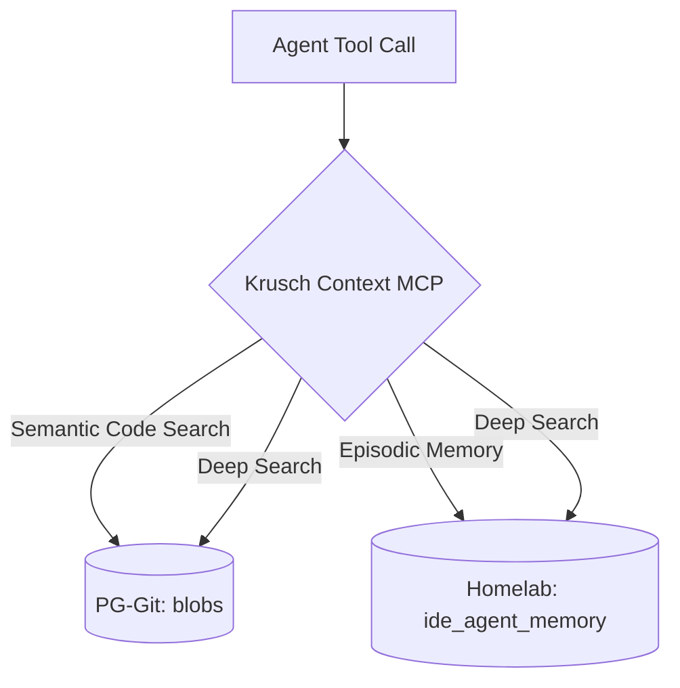

<p align="center">
  <strong>Krusch Context MCP</strong>
</p>

<p align="center">
  <strong>Unified Model Context Protocol server that merges PG-Git codebase search with Homelab episodic memory.</strong>
</p>

<p align="center">
  <a href="https://github.com/kruschdev/krusch-context-mcp"></a>
  <a href="https://github.com/kruschdev/krusch-context-mcp/blob/main/LICENSE"></a>
  
</p>

---

## ⚡ Why Krusch Context MCP?

Previously, each IDE agent session needed two separate MCP servers (`pg-git-mcp` + `krusch-memory-mcp`), each with its own Node.js process, PostgreSQL pool, and Ollama connection. This unified server reduces overhead and introduces "Zero-Trust Context".

### Key Features
- **💾 Shared Connection Pool:** A single `pg.Pool` connected to `kruschdb` on `kruschserv:5434`.
- **🧠 Shared Embeddings:** Shared Ollama embedding logic with fleet-wide round-robin load balancing.
- **🔍 Zero-Trust Context:** The `krusch_context_deep_search` tool queries both codebase (objective) and memory (subjective) in one call.
- **🛠️ Comprehensive Tooling:** Manage episodic memories, browse git trees, and semantically search blobs.

---

## 🧠 Architecture: Zero-Trust Context Engine

The server acts as a unified facade over two distinct PostgreSQL schemas in `kruschdb`:



- **Database**: PostgreSQL + pgvector (`kruschdb` on `kruschserv:5434`)
- **Embeddings**: Ollama `qwen2.5-coder:1.5b` @ 1536 dims, fleet load-balanced
- **Tables**: `blobs` (codebase), `ide_agent_memory` (episodic)
- **Protocol**: MCP Stdio transport

---

## 📦 Installation

```bash
# Requires pg-git sibling project with .env configured
npm install
npm start
```

Or configure it directly in your MCP settings file (e.g., `claude_desktop_config.json` or `.cursor/mcp.json`):

```json
{
  "mcpServers": {
    "krusch-context-mcp": {
      "command": "node",
      "args": ["/home/kruschdev/homelab/projects/krusch-context-mcp/src/index.js"]
    }
  }
}
```

---

## 🚀 Available Tools

| Tool | Description |
|------|-------------|
| `krusch_context_add_memory` | Store an episodic memory (bug, lesson, priority, outcome, activity) |
| `krusch_context_search_memory` | Semantic search over episodic memories with temporal decay |
| `krusch_context_list_memories` | List recent memories by category (no embedding, fast) |
| `krusch_context_delete_memory` | Delete a memory by ID |
| `krusch_context_update_memory` | Update content/tags/project (re-embeds on content change) |
| `krusch_context_consolidate` | Find and merge semantically duplicate memories |
| `krusch_context_search_code` | Semantic search over all indexed codebase files |
| `krusch_context_list_repos` | List all repositories indexed in PG-Git |
| `krusch_context_read_tree` | Browse the file tree of an indexed repository |
| `krusch_context_read_blob` | Read full content of a specific file by blob ID |
| `krusch_context_deep_search` | Composite zero-trust search across both memory and codebase |

---

## 🛠️ Testing

```bash
node test_client.js
```

---

## 🤝 Contributing

We welcome contributions! Please ensure your tests pass and adhere to the project formatting standards.

## 📄 License

MIT License © 2026 kruschdev
