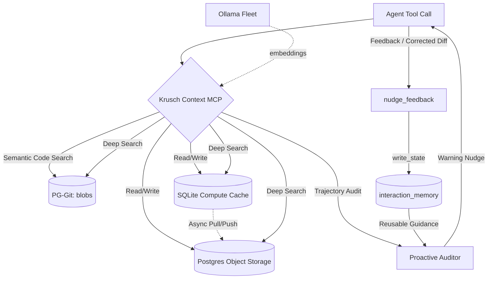

<p align="center">
  
</p>

<p align="center">
  <strong>Unified IDE context engine that merges semantic codebase search with episodic project memory into a single MCP server.</strong>
</p>

[](https://github.com/kruschdev/krusch-context-mcp)
[](https://opensource.org/licenses/MIT)


---

## The Problem

Every time you start a new AI coding session, your agent starts from zero. It doesn't remember the bug you fixed yesterday, the architectural decision you made last week, or even what files exist in your project. You end up re-explaining context, watching it hallucinate stale assumptions, and losing momentum to the "goldfish memory" problem.

**Krusch Context MCP fixes this.** It gives your AI coding agent persistent, searchable memory across every session — paired with semantic search over your entire codebase — so your agent always knows *what* your code does, *why* you built it that way, and *what went wrong last time*.

## What It Does

A single [Model Context Protocol](https://modelcontextprotocol.io/) server exposing **53 tools** to any MCP-compatible IDE agent (Cursor, Claude Code, Windsurf, Gemini CLI, etc.):

| Capability | What It Provides |
|-----------|-----------------|
| ⚡ **Unified Hybrid Retrieval** | Polygres-inspired single-call retrieval combining vector search, multi-hop graph walks (`graph_hops`), server-side token packing (`limit_tokens`), and optional **Rubric4Setwise** minimal cover reranking. |
| 🎯 **Diverse Skill Routing (DSR)** | Determinantal Point Process (DPP) skill routing (`krusch_context_route_skills`) for non-redundant orthogonal tool selection without prompt bloat ([arXiv: 2609.05824](https://arxiv.org/abs/2609.05824)). |
| 🛡️ **Multi-Agent Resilience Gate** | Emergence World stress-testing (`krusch_context_evaluate_resilience`) for error cascades, circular deadlocks, and credential leakage across agent handoffs ([arXiv: 2609.17320](https://arxiv.org/abs/2609.17320)). |
| 🎓 **Hierarchical Teacher Memory** | Workflow, subtask, and function-tier trajectory distillation (`krusch_context_distill_teacher_memory`, `krusch_context_distill_function_memory`) for cross-model student learning ([arXiv: 2608.07169](https://arxiv.org/abs/2608.07169)). |
| ⏳ **Temporal Fact Superseding** | MobileMem temporal fact superseding (`krusch_context_supersede_memory`) and invalidation (`krusch_context_invalidate_memory`) to eliminate outdated knowledge ([arXiv: 2608.13606](https://arxiv.org/abs/2608.13606)). |
| 🔍 **Semantic Codebase Search** | Search the *meaning* of your code, not just filenames. "How do we handle auth?" returns the actual implementation. |
| 🧠 **Episodic Memory** | Bugs, decisions, and lessons persist across sessions, retrieved by semantic relevance with temporal decay. See [Episodic Memory Guide](docs/EPISODIC_MEMORY.md). |
| 💎 **Steering Nudges** | Lightweight key-value facts (preferences, conventions) give the agent behavioral continuity without re-prompting. |
| 🔄 **Agentic Context Management (ACM)** | Structured context lifecycle staging, compaction, eviction retention policies, and context window token budget auditing ([ArXiv: 2607.21503](https://huggingface.co/papers/2607.21503)). |
| 🐞 [**AgentDebugX Error Hub**](https://github.com/AgentDebugX/AgentDebugX) | Failure observability, trajectory root-cause attribution, and execution recovery pattern retrieval for SRE queue healing ([ArXiv: 2607.18754](https://arxiv.org/abs/2607.18754)). |
| ⚙️ **DataFlow-Harness Grounded Codegen** | Grounded MCP operator registry and schema-validated pipeline DAG mutations (`AddNode`, `WireEdge`, `UpdateNodeConfig`) ([ArXiv: 2607.16617](https://arxiv.org/abs/2607.16617)). |
| 📊 **Rubric4Setwise Reranking** | Document-set selection evaluating Redundancy, Conflict, and Complementarity rubrics to filter candidate sets down to minimal covering sets ([ArXiv: 2607.19238](https://arxiv.org/abs/2607.19238)). |
| 🔬 **AREX Deep Research Engine** | Recursively self-improving inner research evidence tracking paired with outer self-improvement constraint audits ([ArXiv: 2607.21461](https://arxiv.org/abs/2607.21461)). |
| 📉 **Structural Trajectory Analysis (STRACE)** | Causal fault isolation across versioned interaction memory to pinpoint first-error steps and failure drift ([ArXiv: 2607.07702](https://arxiv.org/abs/2607.07702)). |
| 🤝 **Session Bridge & Review** | Asynchronous session handoff logging and background telemetry review synthesis by SRE scouts (`write_session_handoff`, `read_session_review`). |
| 📖 **Documentation Search** | Ingested external docs are searchable locally — your agent references *your* versions, not its training data. |
| 🛡️ **Proactive Auditor (Memory Agent)** | Trajectory auditing that learns from feedback (Direct-OPD) to verify trajectories and log alignment signals. |
| 🌍 **Zero-Trust Deep Search** | One tool call cross-references codebase reality with historical memory to verify understanding before acting. |

## Why You'd Want It

**🛡️ Everything stays on your hardware** — All embeddings via local [Ollama](https://ollama.com/) (`bge-large` + `qwen2.5-coder:1.5b` or `llama3.2`). Storage is PostgreSQL + pgvector + SQLite. Zero API costs, full data sovereignty.

**🔄 Switch models without losing context** — Memory is decoupled from the reasoning engine. Swap between Gemini, Claude, GPT-4o, or local models mid-project — every model inherits the same context.

**🔌 Model-Provider & Cloud Agnostic (OpenRouter & Polygres.com)** — While local Ollama and local Postgres are supported out-of-the-box, `krusch-context-mcp` is fully provider-agnostic. You can host your database on [Polygres.com](https://polygres.com) (`DATABASE_URL`) and generate cloud `bge-large` embeddings via [OpenRouter](https://openrouter.ai) (`EMBEDDING_URL="https://openrouter.ai/api/v1/embeddings"`, `EMBED_MODEL="baai/bge-large-en-v1.5"`), or use any OpenAI-compatible endpoint (LM Studio, `llama-server`, vLLM).

**⚡ One server, not three** — Codebase search, episodic memory, and steering nuggets in a single process with shared connection pool and embedding pipeline.

---

## Quick Start

**Prerequisites:** [Node.js 22+](https://nodejs.org/) · [Ollama](https://ollama.com/) with `bge-large` and `qwen2.5-coder:1.5b` (or `llama3.2`) · PostgreSQL with [`pgvector`](https://github.com/pgvector/pgvector)

```bash
# 1. Clone and install (fully native consolidated engine — no external sibling packages required)
git clone https://github.com/kruschdev/krusch-context-mcp.git
cd krusch-context-mcp
npm install
cp .env.example .env  # Configure your PostgreSQL connection

# 2. Ingest codebase (optional but recommended)
npm run snapshot -- .

# 3. Start MCP Server
npm start
```

Add to your IDE MCP settings (e.g., `.cursor/mcp.json`, `claude_desktop_config.json`):

```json
{
  "mcpServers": {
    "krusch-context-mcp": {
      "command": "node",
      "args": ["/path/to/krusch-context-mcp/src/index.js"]
    }
  }
}
```

Restart your IDE — your agent now has access to all 53 tools.

> **Upgrading?** `git pull origin main && npm install && npm start` — idempotent migrations run on startup.

---

## Architecture



| Component | Details |
|-----------|---------|
| **Storage** | Hybrid: Local SQLite (per-project) + PostgreSQL (global & codebase) |
| **Embeddings** | Ollama `bge-large` @ 1024 dims, fleet load-balanced |
| **Tagging** | Ollama `llama3.2` for automatic keyword extraction |
| **Temporal Decay** | `score = similarity × e^(-0.01 × age_days)` — relevance drops ~26% after 30 days |

### Key Design Decisions

- **Lakebase Architecture** — Local SQLite for zero-latency reads, async write-behind to durable PostgreSQL. A `+0.3` local scoring bias mitigates Ebbinghaus forgetting as the global corpus grows. *Inspired by [Neon](https://neon.com/docs/introduction/architecture-overview).*
- **pgContext Vector Engine** — Native PostgreSQL 17 page-native HNSW index access method (`pgcontext_hnsw`) with single-pass JSON metadata filtering and exact MVCC/RLS re-checking, preventing vector recall collapse under selective filters. *Inspired by [Evokoa pgContext](https://github.com/evokoa/pgContext).*
- **AgentDebugX Error Hub** — Failure observability, trajectory root-cause attribution, and execution recovery pattern retrieval for automated error healing. *Inspired by [AgentDebugX](https://github.com/AgentDebugX/AgentDebugX).*
- **Hybrid Retrieval** — Auto-tagged via `llama3.2` to address pure-cosine failure modes (negation, numeric, role-swap). *Per [Sentra](https://sentra.app).*
- **Consolidation** — Semantic dedup via L2-normalized centroid averaging without re-embedding. *From [Geometry of Consolidation](https://github.com/niashwin/geometry-of-consolidation).*
- **Holographic Nuggets** — Lightweight steering facts adapted from [NeoVertex1/nuggets](https://github.com/NeoVertex1/nuggets).
- **Proactive Context Agent** — Trajectory auditor (OPD/PUST) that checks active logs against rules, records feedback alignment traces, and improves over time.

### Company Brain Substrate (v2)

Implements the three-layer organizational memory model from the [Sentra "Company Brain" research](https://sentra.app):

1. **Factual Memory** — Raw codebase state + episodic events → *"what happened"*
2. **Interaction Memory** — Parent-child UUID lineage, attribution, conflict resolution → *"why it happened"*
3. **Action Memory** — Autonomous state compilation and graph traversal → *"what to do next"*

---

## Usage Examples

### Episodic Memory

For a detailed technical guide on categories, architecture, sync mechanics, and agent lifecycle patterns, see the [Episodic Memory Guide](docs/EPISODIC_MEMORY.md).

> **You:** "That fixed the port conflict! Save this."  
> **Agent:** *[`add_memory`]* Saved to 'bugs': port 5441 conflicts with legacy DB, use 5442.

> **You:** "How did we structure the auth system?"  
> **Agent:** *[`search_memory`]* From 'lessons': chose singleton JWT factory to avoid circular dependencies.

### Granularity-Aware Search (GRASP)

`search_memory` supports deterministic GRASP parameters to dynamically adjust context depth and retrieval strategy:
* **Keyword/Tag Matches:** Bypass dense vector search to retrieve exact terms or tags:
  `search_memory({ category: "lessons", query: "JWT", search_type: "keyword" })`
* **Version Provenance Lineage:** Automatically retrieve and append the parent revision chain of the memory:
  `search_memory({ category: "priorities", query: "database", include_history: true })`
* **Codebase Edge Resolution:** Fetch and append linked git blob references (`memory_to_blob_edges`):
  `search_memory({ category: "bugs", query: "VRAM leak", include_linked_blobs: true })`

### Codebase Search

> **You:** "How does our auth middleware work?"  
> **Agent:** *[`search_code`]* Found 3 files — here's the implementation in `lib/auth.js`...

### Zero-Trust Verification

> **You:** "Before we start, verify what you know about the DB schema."  
> **Agent:** *[`deep_search`]* Cross-referencing codebase + memory — schema uses pgvector 1024 dims, last session added the `tags` column.

### Steering Nudges

> **You:** "Always use `const` over `let` in this project."  
> **Agent:** *[`nugget_remember`]* Saved: `coding-style:const-over-let`.

### Multi-Agent Conflict Resolution

> **You:** "The previous agent was wrong about the database port."  
> **Agent:** *[`resolve_conflict`]* Merged conflicting states. Deprecated old branches, created unified resolution.

### Proactive Context Auditing & Alignment Loop

> **You:** "Let's index the daily research papers using qwen2.5-coder:1.5b embeddings."  
> **Agent:** *[`proactive_nudge`]* Warning: The postgres `ide_agent_memory` table embedding column is constrained to 1024 dimensions. `qwen2.5-coder:1.5b` embeddings have 1536 dimensions and will fail. Always use `bge-large` embeddings.
>
> **Agent:** *[`nudge_feedback`]* Logs feedback indicating the warning was accepted and the trajectory was corrected. This alignment signal (Direct-OPD) is retrieved in future sessions as reusable guidance.

---

## Agent Integration Patterns

### Pattern 1: Zero-Trust Session Start

```
1. deep_search({ query: "<topic>", project: "<project>" })
   → Verify codebase + memory in one call

2. nugget_nudges({ query: "<task>", active_project: "<project>" })
   → Load conventions and preferences
```

### Pattern 2: Bug Investigation

```
1. search_memory({ category: "bugs", query: "<symptoms>" })     → Check history
2. search_code({ query: "<error>", project: "<project>" })      → Find implementation
3. [Fix the bug]
4. add_memory({ category: "bugs", content: "<root cause + fix>" }) → Document
```

### Pattern 3: Session Close

```
1. add_memory({ category: "outcomes", content: "<decisions and results>" })
2. nugget_remember({ key: "<project>:last-session", value: "<in-progress work>" })
3. consolidate({ category: "activity", project: "<project>", dry_run: true })
```

### Pattern 4: Proactive Trajectory Auditing

```
1. proactive_nudge({ history: "<conversation history window>", project: "<project>" })
   → Background threat-audit of agent trajectory against historical lessons, bugs, and rules before executing code changes
```

---

## Tool Quick-Reference

> Full parameter details, defaults, schemas, and usage examples → **[Tool Reference](docs/TOOL_REFERENCE.md)**

| Tool | Category | Description |
|------|----------|-------------|
| `retrieve` | **Hybrid Retrieval** | Single-call hybrid retrieval combining dense vectors, multi-hop graph walks, stage-aware pruning, and server-side token budget packing |
| `add_memory` | **Episodic Memory** | Store a persistent memory (bug, lesson, priority, outcome, activity); supports `supersedes_id` |
| `supersede_memory` | **Episodic Memory** | MobileMem temporal fact superseding — mark prior memory superseded and insert updated replacement with lineage |
| `invalidate_memory` | **Episodic Memory** | MobileMem memory invalidation — revoke outdated memory record from active semantic retrieval |
| `search_memory` | **Episodic Memory** | Semantic search with temporal decay and dynamic GRASP filtering (keyword, provenance history, linked blobs) |
| `list_memories` | **Episodic Memory** | List recent memories filtered by category and project |
| `delete_memory` / `update_memory` | **Episodic Memory** | Delete or update memory content and metadata by ID |
| `consolidate` | **Episodic Memory** | Centroid-based semantic memory compression and deduplication without re-embedding |
| `compile_state` | **Company Brain v2** | Contextmaxxing — compile multi-scale project state (micro, meso, macro) into prompt context |
| `write_state` | **Company Brain v2** | Stateful write with optimistic concurrency control, lineage tracking, and attribution |
| `resolve_conflict` | **Company Brain v2** | Merge conflicting sibling states and mark outdated branches deprecated |
| `get_provenance` | **Company Brain v2** | Trace version history and parent-child interaction lineage |
| `search_lens` | **Company Brain v2** | Role-filtered semantic retrieval tailored to specific personas (Architect, SRE, Product) |
| `traverse_graph` | **Company Brain v2** | Navigate parent/child state lineage and linked codebase blobs |
| `update_ontology` | **Company Brain v2** | Manage project tags, ontology nodes, and domain categories |
| `link_blob` | **Company Brain v2** | Create explicit graph edges between episodic memories and git code blobs |
| `search_code` | **Codebase Search** | Semantic search over indexed git blobs matching natural language intent |
| `deep_search` | **Codebase Search** | Composite zero-trust search cross-referencing subjective memory and objective codebase reality |
| `list_repos` | **Codebase Search** | Browse indexed repositories registered in PG-Git |
| `read_tree` | **Codebase Search** | Inspect repository file hierarchy and directory trees |
| `read_blob` | **Codebase Search** | Retrieve full file content by blob hash or file path |
| `nugget_remember` | **Steering Nuggets** | Store key-value steering fact (conventions, coding style, preferences) |
| `nugget_nudges` | **Steering Nuggets** | Retrieve steering facts semantically relevant to current task or project |
| `nugget_forget` | **Steering Nuggets** | Delete steering fact by key |
| `nugget_list` | **Steering Nuggets** | List all active steering nuggets for a project |
| `manage_lifecycle` | **ACM** | Agentic Context Management fragment lifecycle (stage, compact, evict, get, list) |
| `audit_budget` | **ACM** | Agentic Context Management token budget pressure and eviction recommendations |
| `log_agent_failure` | **AgentDebugX** | Log agent execution failure, error symptoms, and candidate recovery patches |
| `search_failures` | **AgentDebugX** | Search past agent failures by semantic symptom or agent role for SRE healing |
| `get_recovery_pattern` | **AgentDebugX** | Retrieve validated recovery pattern and patch bundle for a recorded failure |
| `register_pipeline_operator`| **DataFlow-Harness**| Register typed, schema-validated operator in the grounded data pipeline registry |
| `inspect_pipeline_registry` | **DataFlow-Harness**| Inspect and search registered operators with filter and documentation |
| `mutate_pipeline_dag` | **DataFlow-Harness**| Apply atomic, validated DAG mutations (`AddNode`, `WireEdge`, `UpdateNodeConfig`) |
| `setwise_rerank` | **Rubric4Setwise** | Rerank document sets using Redundancy, Conflict, and Complementarity rubrics |
| `update_research_state` | **AREX** | Update inner deep research state (verified evidence, unresolved constraints, next action hints) |
| `arex_audit` | **AREX** | Audit research constraints and evaluate stopping convergence for deep research |
| `distill_teacher_memory` | **Teacher Distillation**| Log teacher execution trajectory (workflow, subtask, function tier) for student learning |
| `retrieve_teacher_distillation` | **Teacher Distillation**| Retrieve distilled teacher trajectories matching task query and tier |
| `distill_function_memory` | **Teacher Distillation**| Distill tool call failure and teacher fix into Tier 3 Function Memory for student error recovery |
| `route_skills` | **Skills & Gating** | Diverse Skill Routing (DSR) via DPP for non-redundant orthogonal skill selection |
| `evaluate_resilience` | **Skills & Gating** | Multi-Agent Resilience Gate auditing handoffs for error cascades, deadlocks, and credential leaks |
| `list_skills` | **Skills & Gating** | Browse registered homelab agent skills |
| `get_skill` | **Skills & Gating** | Retrieve skill documentation, operational procedures, and instructions |
| `proactive_nudge` | **Auditing & Reason** | Trajectory auditing — proactively warn on rule or lesson violations before execution |
| `nudge_feedback` | **Auditing & Reason** | Record developer feedback on proactive nudges as reusable alignment signals (Direct-OPD) |
| `analyze_trajectory` | **Auditing & Reason** | Trajectory auditing and causal fault isolation using STRACE to isolate root errors |
| `think` | **Auditing & Reason** | Context synthesis, conflict detection, and gap analysis combining memory and code |
| `write_session_handoff` | **Session Bridge** | Record session close summary, files touched, and link telemetry for background review |
| `read_session_review` | **Session Bridge** | Read pending or latest session reviews generated by persistent SRE scouts |
| `docs_list` | **External Docs** | List all ingested external documentation manuals |
| `docs_search` | **External Docs** | Search within a specific documentation manual using vector similarity |
| `health_check` | **System** | Verify MCP server status, database connection pool, and model connectivity |

---

## Project Structure

```
krusch-context-mcp/
├── src/
│   ├── index.js                     # MCP server entry — tool registration & dispatch (53 tools)
│   ├── memory-engine.js             # Episodic memory CRUD, temporal superseding & consolidation
│   ├── v2-engine.js                 # Company Brain v2 substrate (factual/interaction/action memory)
│   ├── nuggets-engine.js            # Holographic Nuggets steering facts CRUD
│   ├── unified-retrieval.js         # Unified Hybrid Retrieval engine (Stage-Aware Pruning)
│   ├── acm-engine.js                # Agentic Context Management (ACM) & token budget auditing
│   ├── agentdebugx-engine.js        # AgentDebugX Error Hub & failure observability
│   ├── dataflow-engine.js           # DataFlow-Harness grounded pipeline registry & DAG mutations
│   ├── setwise-engine.js            # Rubric4Setwise minimal cover document-set selection
│   ├── arex-engine.js               # AREX deep research state engine & constraint audit
│   ├── teacher-distillation-engine.js # Hierarchical teacher memory distillation (workflow/subtask/function)
│   ├── skills-engine.js             # Diverse Skill Routing (DSR via DPP) & skills registry
│   ├── session-engine.js            # Session handoff persistence & Jean SRE bridge
│   ├── sqlite-engine.js             # Lakebase SQLite compute cache (pull/push sync)
│   ├── pgcontext-helper.js          # pgContext extension detection & HNSW index setup
│   ├── proactive-engine.js          # Proactive trajectory auditor & Multi-Agent Resilience Gate
│   ├── think-engine.js              # Cited synthesis, conflict detection & gap analysis
│   └── llm-tags.js                  # Shared LLM tag generation (qwen2.5-coder:1.5b)
├── scripts/                         # Benchmarking, evaluation, and maintenance
├── tests/                           # *.test.js = automated, test_*.js = smoke
├── docs/
│   ├── TOOL_REFERENCE.md            # Full parameter reference for all 53 tools
│   ├── SETUP.md                     # Configuration, storage routing, troubleshooting
│   └── research/                    # Sentra Company Brain research essays
└── package.json
```

---

## Testing

```bash
npm test                                # Automated (node:test, *.test.js)
npm run test:smoke                      # JSON-RPC stdio smoke tests
node tests/test_client.js               # All 53 tools against live DB
node tests/test_ai_watch_integrations.js # AI Watch paper integration suite
node scripts/benchmark_latency.js       # End-to-end latency
node scripts/eval_accuracy.js           # Precision/recall
```

> **Convention:** `*.test.js` = automated tests · `test_*.js` = stdio smoke tests

---

## Related Projects & Infrastructure

| Project / Service | Role |
|-------------------|------|
| [PG-Git-MCP](https://github.com/kruschdev/pg-git-mcp) | Standalone codebase search engine (sibling project sharing schema) |
| [Polygres.com](https://polygres.com) | AI-native PostgreSQL cloud platform by Evokoa (`pgContext` & `pgGraph` native) |
| [OpenRouter.ai](https://openrouter.ai) | Unified cloud LLM & embedding API (`baai/bge-large-en-v1.5`) |
| [AgentDebugX](https://github.com/AgentDebugX/AgentDebugX) | Open-source failure observability, attribution, and recovery toolkit |
| [Krusch Memory MCP](https://github.com/kruschdev/krusch-memory-mcp) | Legacy standalone memory (superseded) |
| [Krusch Sequential MCP](https://github.com/kruschdev/krusch-sequential-mcp) | Sequential thinking with PG persistence |
| [Krusch Cascade Router](https://github.com/kruschdev/krusch-cascade-router) | Automated LLM inference routing |
| [NeoVertex Nuggets](https://github.com/NeoVertex1/nuggets) | Original Holographic Nuggets architecture |

---

## Acknowledgments & References

This project is built upon and inspired by the following foundational research papers, architectural frameworks, and open-source projects:

### Architectural Foundations & Cloud Services
- **Polygres AI-Native Database**: Postgres for the Agent Era by Evokoa combining relational, graph, and vector capabilities ([Polygres.com](https://polygres.com)).
- **OpenRouter Embeddings Engine**: Unified cloud embeddings API for `baai/bge-large-en-v1.5` vector generation ([OpenRouter.ai](https://openrouter.ai)).
- **Company Brain Substrate (v2)**: Core concept and multi-layered organizational memory model inspired by the [Sentra "Company Brain" Essay Series](https://sentra.app).
- **Holographic Nuggets**: Lightweight key-value steering facts adapted from the original [NeoVertex Nuggets](https://github.com/NeoVertex1/nuggets) design.
- **AgentDebugX Error Hub**: Failure observability, trajectory root-cause attribution, and Error Hub recovery patch bundles powered by [AgentDebugX](https://github.com/AgentDebugX/AgentDebugX).
- **Lakebase Compute/Storage Decoupling**: Storage routing and local-first compute cache separation inspired by the [Neon Serverless Postgres Architecture](https://neon.tech/docs/introduction/architecture-overview).
- **Tool Tracing & Optimization**: Automated optimization of agent execution paths powered by the [HALO RLM Engine](https://github.com/context-labs/halo).
- **pgContext Vector Acceleration**: Native PostgreSQL 17 HNSW index access method and single-pass metadata filtering powered by [Evokoa pgContext](https://github.com/evokoa/pgContext).

### Research Papers & Algorithms
- **Agentic Context Management (ACM)**: Context lifecycle staging, compaction, eviction retention, and token budget auditing based on Gaurav Dadhich, [Agentic Context Management: Solving Agent Memory and Cost by Treating Them as Lifecycle and Architecture Problems](https://huggingface.co/papers/2607.21503) (ArXiv: 2607.21503).
- **AgentDebugX (Failure Observability & Error Hub)**: Open-source toolkit for failure observability, trajectory root-cause attribution, and recovery patch bundles based on Wang et al., [AgentDebugX: An Open-Source Toolkit for Failure Observability, Attribution, and Recovery in LLM Agents](https://huggingface.co/papers/2607.18754) ([AgentDebugX GitHub](https://github.com/AgentDebugX/AgentDebugX) · ArXiv: 2607.18754).
- **DataFlow-Harness (Grounded Code-Agent Platform)**: Grounded MCP operator registry and typed, schema-validated DAG mutations based on Zhang et al., [DataFlow-Harness: A Grounded Code-Agent Platform for Constructing Editable LLM Data Pipelines](https://huggingface.co/papers/2607.16617) (ArXiv: 2607.16617).
- **Rubric4Setwise (Beyond Relevance-Centered Retrieval)**: Rubric-oriented document-set selection evaluating Redundancy, Conflict, and Complementarity into minimal covering sets based on Liu et al., [Beyond Relevance-Centered Retrieval: Rubric-Oriented Document-Set Selection and Ranking](https://huggingface.co/papers/2607.19238) (ArXiv: 2607.19238).
- **AREX (Recursively Self-Improving Deep Research)**: Inner research evidence state paired with outer self-improvement constraint audits based on Lu et al., [AREX: Towards a Recursively Self-Improving Agent for Deep Research](https://huggingface.co/papers/2607.21461) (ArXiv: 2607.21461).
- **Diverse Skill Routing (DSR)**: Determinantal Point Process (DPP) skill routing that balances task relevance with orthogonal diversity to eliminate tool overlap and prompt bloat based on [Diverse Skill Routing via Determinantal Point Processes for LLM Agents](https://arxiv.org/abs/2609.05824) (ArXiv: 2609.05824).
- **Emergence World (Multi-Agent Resilience Gate)**: Adversarial stress-testing and anomaly detection for multi-agent execution graphs, catching error cascades, circular delegation deadlocks, and credential leaks across agent handoffs based on [Emergence World: Stress-Testing Cascading Failures and Cross-Agent Deadlocks in Multi-Agent Trajectories](https://arxiv.org/abs/2609.17320) (ArXiv: 2609.17320).
- **Hierarchical Teacher Distillation**: Multi-tier cross-model trajectory and tool error recovery (Workflow, Subtask, and Function tiers) allowing smaller student models to learn operational rules from frontier teacher models based on Taeil Kim, Kangsan Kim, Sung Ju Hwang, [Agent Memory Distillation: Empowering Small LLM Agents with Hierarchical Teacher Memory](https://arxiv.org/abs/2608.07169) (ArXiv: 2608.07169).
- **MobileMem (Temporal Fact Superseding & Invalidation)**: Temporal knowledge graph evolution, explicit fact superseding, and active lineage filtering excluding obsolete memories from active retrieval based on [MobileMem: Lifelong Agent Memory with Temporal Knowledge Graph Evolution and Invalidation](https://arxiv.org/abs/2608.13606) (ArXiv: 2608.13606).
- **Stage-Aware Context Pruning**: Multi-stage marginal value reduction (pre-retrieval query cleansing, post-retrieval duplicate suppression, and pre-synthesis boilerplate stripping) based on Chen et al., [Not Worth Another Token: Marginal Value Estimation for Efficient Deep Research Agents](https://arxiv.org/abs/2608.08389) (ArXiv: 2608.08389).
- **Structural Trajectory Analysis (STRACE)**: Step-level execution path tracing, anomaly scoring, and Causal Fault Isolation in versioned interaction memory based on Zhou et al., [From Noisy Traces to Root Causes: Structural Trajectory Analysis and Causal Extraction for Agent Optimization](https://arxiv.org/abs/2607.07702) (ArXiv: 2607.07702).
- **Semantic Consolidation**: Centroid-based semantic memory compression without re-embedding based on Ashwin et al., [Geometry of Consolidation](https://github.com/niashwin/geometry-of-consolidation).
- **Proactive Memory Agent**: Long-horizon execution warnings and memory-guided auditing based on Wu et al., [Remember When It Matters: Proactive Memory Agent for Long-Horizon Agents](https://arxiv.org/abs/2607.08716) (ArXiv: 2607.08716).
- **Direct On-Policy Distillation (Direct-OPD)**: Weak-to-strong feedback distillation for proactive context rules based on Feng et al., [Weak-to-Strong Generalization via Direct On-Policy Distillation](https://arxiv.org/abs/2607.05394) (ArXiv: 2607.05394).
- **Proxy Exploration and Reusable Guidance (PUST)**: Modular guidance paradigm using feedback traces based on Fu et al., [Proxy Exploration and Reusable Guidance: A Modular LLM Post-Training Paradigm via Proxy-Guided Update Signals](https://arxiv.org/abs/2607.11505) (ArXiv: 2607.11505).
- **Granularity-Aware Search Policy (GRASP)**: Dynamic context depth expansion for search queries based on Gandhi et al., [GRASP: GRanularity-Aware Search Policy for Agentic RAG](https://arxiv.org/abs/2607.10463) (ArXiv: 2607.10463).

## Contributing

We welcome contributions! Please ensure tests pass and adhere to the project formatting standards.

## License

MIT License © 2026 [kruschdev](https://github.com/kruschdev)
