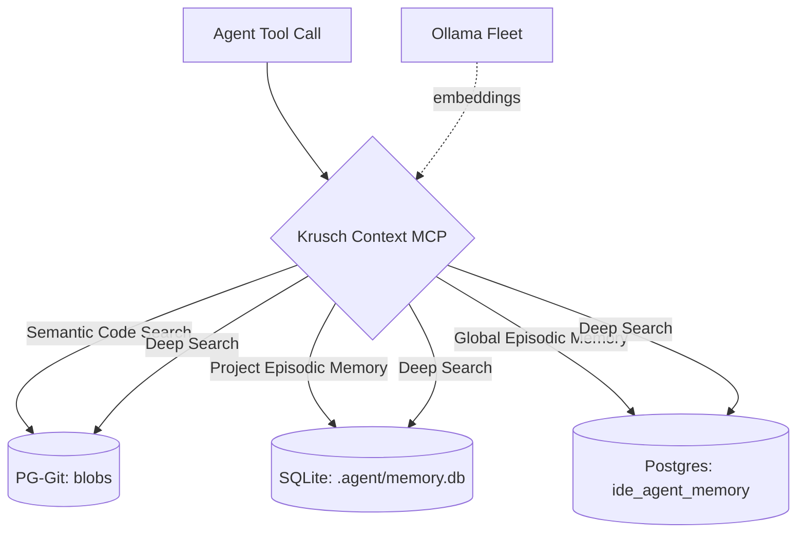

<p align="center">
  
</p>

<p align="center">
  <strong>Unified IDE context engine that merges semantic codebase search with episodic project memory into a single MCP server.</strong>
</p>

[](https://github.com/kruschdev/krusch-context-mcp)
[](https://opensource.org/licenses/MIT)


---

## ⚡ Why Krusch Context MCP?

Previously, each IDE agent session needed two separate MCP servers (`pg-git-mcp` + `krusch-memory-mcp`), each with its own Node.js process, PostgreSQL pool, and Ollama connection. This unified server collapses them into a single process and introduces **Zero-Trust Context** — the philosophy that an AI agent must *verify* its understanding of your codebase before acting, never assuming stale context is current.

### 🛡️ Provider Independence & Sovereign Infrastructure

By leveraging local Ollama instances (`qwen2.5-coder:1.5b` for embeddings, `llama3.2` for tagging) and local PostgreSQL with `pgvector`, Krusch Context MCP drastically decreases reliance on external LLM providers (like OpenAI, Anthropic, or Google).

- **Universal Codebase Search & Repository Browsing:** You aren't reliant on a provider's proprietary file-upload UI (like Claude Projects or OpenAI Custom GPTs). Because your entire codebase is stored in local PostgreSQL, any model you plug in instantly gains deep semantic search (`krusch_context_search_code`) AND the ability to autonomously browse project file structures by following directory links (`krusch_context_read_tree` and `krusch_context_read_blob`).
- **External Framework & Manual Independence:** You aren't reliant on an LLM's pre-trained knowledge or provider-hosted web searches. By ingesting external code manuals into your local vector database, any model has instant, hallucination-free access to the exact library versions you use via the `krusch_docs_list` and `krusch_docs_search` tools.
- **Zero API Costs for Context:** You aren't charged per-token to continuously embed, re-index, or search your own codebase, manuals, and episodic memories.
- **Data Privacy & IP Protection:** Your proprietary code, architectural decisions, and bug reports stay entirely on your own metal.

### 🔄 Seamless Model Switching (The "Swappable Brain")

By decoupling long-term memory and codebase context from the reasoning engine, your project history outlives any individual chat session or provider context window. This enables you to seamlessly switch your primary IDE agent mid-project:

- **Start your day** with **Gemini Pro** to leverage its massive context window for planning a large refactor.
- **Switch to** **Claude Opus** for meticulous, precise code execution and bug hunting.
- **Pivot to** **GPT-4o** for generalized reasoning or exploring a new framework.
- **Failover to** a local **Ollama** model if your internet drops or a cloud provider experiences an outage.

Because the intelligence stack and retrieval pipeline run locally on your metal, the new agent immediately inherits the exact same knowledge, codebase understanding, and episodic memory as the previous one. You are immune to model deprecation, provider outages, and ecosystem lock-in.

### Key Features
- **💾 Shared Connection Pool:** A single `pg.Pool` connected to `kruschdb`, eliminating duplicate database connections.
- **🧠 Shared Embeddings:** Shared Ollama embedding logic with fleet-wide round-robin load balancing across multiple GPU nodes.
- **🔍 Zero-Trust Context:** The `krusch_context_deep_search` tool queries both codebase (objective) and memory (subjective) in one call, giving agents a holistic reality check.
- **📌 Zero-Trust Project Separation:** Project-specific episodic memories are physically isolated in local SQLite databases (`<project>/.agent/memory.db`), while global homelab learnings are stored in the central PostgreSQL database. This hybrid approach guarantees project context never leaks.
- **🏷️ Auto-Tagging:** Memories are automatically tagged with keywords via `llama3.2`, making them discoverable without manual effort.
- **♻️ Memory Consolidation:** Semantic deduplication detects and merges overlapping memories to prevent context bloat.
- **💎 Holographic Nuggets Memory:** A unified, lightweight Key-Value store integrated directly into PostgreSQL to hold steering facts, user preferences, and project guidelines. *Credits to [NeoVertex1/nuggets](https://github.com/NeoVertex1/nuggets) for the original Holographic Nuggets MCP architecture.*

---

## 🧠 Architecture: Hybrid Zero-Trust Context Engine

The server acts as a unified facade over local SQLite databases and PostgreSQL schemas in `kruschdb`:



| Component | Details |
|-----------|---------|
| **Database** | Hybrid: Local SQLite (Project Memories) + PostgreSQL (Global & Codebase) |
| **Embeddings** | Ollama `qwen2.5-coder:1.5b` @ 1536 dims, fleet load-balanced |
| **Tagging** | Ollama `llama3.2` for automatic keyword extraction |
| **Tables** | `blobs` (Codebase), `ide_agent_memory` (Episodic), `ide_agent_nuggets` (Steering facts) |
| **Protocol** | MCP Stdio transport |
| **Temporal Decay** | Exponential decay rate of 0.01 — a memory's relevance drops ~26% after 30 days of inactivity |

---

## 📦 Quick Start

**Prerequisites:**
- [Node.js](https://nodejs.org/) 18+
- [Ollama](https://ollama.com/) running with `qwen2.5-coder:1.5b` and `llama3.2` models
- PostgreSQL with `pgvector` extension
- The sibling `pg-git` project with a configured `.env`

**1. Install dependencies:**
```bash
cd projects/krusch-context-mcp
npm install
```

**2. Start the server:**
```bash
npm start
```

**3. Add to your IDE MCP settings** (e.g., `claude_desktop_config.json`, `.cursor/mcp.json`, or Antigravity config):
```json
{
  "mcpServers": {
    "krusch-context-mcp": {
      "command": "node",
      "args": ["/path/to/krusch-context-mcp/src/index.js"]
    }
  }
}
```

**4. Restart your IDE.** That's it — your agent now has access to all 18 tools.

---

## 🚀 Real-World Usage Examples

To effectively use Krusch Context MCP, simply instruct your IDE agent to document its findings or query its memory.

**Example 1: Documenting a bug fix**
> **You:** "That fixed the port conflict! Save this to memory so we don't forget the fix."
> **Agent:** *[Calls `krusch_context_add_memory`]* "Saved a memory in the 'bugs' category noting that port 5441 conflicts with the legacy DB and we should use 5442 instead."

**Example 2: Recalling architectural decisions**
> **You:** "How did we decide to structure the auth system?"
> **Agent:** *[Calls `krusch_context_search_memory`]* "According to the 'lessons' category, we chose a singleton JWT factory to avoid circular dependencies."

**Example 3: Zero-Trust Context check**
> **You:** "Before we start, verify what you know about the database schema."
> **Agent:** *[Calls `krusch_context_deep_search`]* "Cross-referencing codebase search (blobs) with episodic memory — the schema uses pgvector with 1536 dims, and our last session noted we added the `tags` column."

**Example 4: Memory Consolidation**
> **You:** "Clean up the repetitive notes about the migration."
> **Agent:** *[Calls `krusch_context_consolidate`]* "Found 4 overlapping memories, consolidated into 2 clean records."

**Example 5: Browsing indexed code**
> **You:** "Show me the file tree for the krusch-context-mcp repo."
> **Agent:** *[Calls `krusch_context_read_tree`]* "Here's the indexed tree: `src/index.js`, `src/memory-engine.js`, `package.json`..."

---

## 🤖 The Autonomous Agent Lifecycle

Krusch Context MCP is designed for **infinite session continuity** — your agent never starts from zero. Four workflows form a complete daily lifecycle:

### 1. `/open` — Start the Day
At the beginning of a work session, type `/open`. The agent will:
1. **Load Priorities:** Call `krusch_context_search_memory` with `category: 'priorities'` to align on today's goals.
2. **Load Outcomes:** Call `krusch_context_search_memory` with `category: 'outcomes'` to review what happened yesterday.
3. **Retrieve Nudges:** Call `krusch_context_nugget_nudges` to load lightweight project hints and preferences.
4. **Scan for Drift:** Call `krusch_context_search_code` to verify its understanding of the codebase hasn't drifted.

### 2. `/close` — Pause Work
When stepping away, tell your agent `/close`. It will:
1. **Self-Sync:** Take a semantic snapshot of the project codebase into `kruschdb.blobs`.
2. **Save Local State:** Write active files, fragile components, and next steps to `INFLIGHT.md`.
3. **Commit to Long-Term Memory:** Call `krusch_context_add_memory` to embed the session's decisions and outcomes into the vector database.
4. **Save Steering Facts:** Call `krusch_context_nugget_remember` to persist lightweight behavioral patterns for future sessions.

### 3. `/continue` — Resume Work
When returning to an existing task, type `/continue`. The agent will:
1. **Read Local State:** Load `INFLIGHT.md` for the active task list.
2. **Retrieve Semantic Context:** Call `krusch_context_search_memory` to dynamically load relevant historical context.
3. **Retrieve Nudges:** Call `krusch_context_nugget_nudges` to load lightweight project hints.
4. **Verify Codebase State:** Call `krusch_context_search_code` to confirm its understanding of the current implementation matches reality.

### 4. `/sweetdreams` — Nightly Consolidation
While you sleep, `/sweetdreams` runs a fleet-wide maintenance pass:
1. **Batch Sync:** Re-indexes all project codebases into the `blobs` table via `sync_all_projects.js`.
2. **Memory Optimization:** Runs `optimize_ide_agent_memory.js` to ensure B-Tree and HNSW indexes are in place for fast retrieval.
3. **Swarm Dispatch:** Queues overnight analysis tasks for the Chrysalis execution swarm (fleet health sweep, memory synthesis).

**The Result:** The agent dynamically pulls the exact context it needs, giving it infinite continuity across sessions without hallucinating stale state.

### `INFLIGHT.md` Template

```markdown
# Project Name - Session State

**Status**: In Progress | Stable | Blocked
**Last Updated**: YYYY-MM-DD

## Current State
- Brief summary of what was accomplished this session.

## Fragile Files / Transient State
- Files or state that must not be touched without understanding context.

## Pending / Next Steps
- [ ] Next task 1
- [ ] Next task 2
```

This keeps the context engine lean and accurate without manual intervention.

### Workflow Example: `/close`

Here is a real example of a project-level `.agent/workflows/close.md` that leverages both the deep episodic memory and the lightweight holographic nuggets:

```markdown
# /close

1. **Self-Sync**: Take a semantic snapshot of this project.
   \`\`\`bash
   node /home/kruschdev/homelab/projects/pg-git/scripts/sync_to_pg.js .
   \`\`\`

2. **Update INFLIGHT.md**:
   - Overwrite \`INFLIGHT.md\` in this project root.
   - Document any **Fragile** files and transient state.

3. **Log Activity**:
   - Execute \`krusch_context_add_memory\` with \`category: 'activity'\`, \`project: 'my-project'\` and content summarizing this session's work.

4. **Save Steering Facts**:
   - Store any new patterns via \`krusch_context_nugget_remember\` with \`kind: 'project'\`, key prefixed \`my-project:\`.

5. **Summarize**:
   > "State saved. See you next session."
```

### Workflow Example: `/open`

This global workflow sets the tone for the entire day, grabbing cross-project context:

```markdown
# /open

1. **Context Load & Alignment**: Immediately run parallel tool calls to construct the context for the day:
   - **Priorities**: Query \`krusch_context_search_memory(category: 'priorities')\` to load current global goals.
   - **Outcomes**: Query \`krusch_context_search_memory(category: 'outcomes')\` to review what happened yesterday.
   - **Nuggets**: Query \`krusch_context_nugget_nudges\` to grab any lightweight project hints or preferences.
   - **Zero-Trust Codebase**: Execute \`krusch_context_search_code\` to query codebase state natively.

2. **Summarize**: 
   - State what is currently mid-flight and ask for confirmation to resume the active \`INFLIGHT.md\` task.
```

### Workflow Example: `/continue`

A project-scoped workflow to resume work exactly where you left off:

```markdown
# /continue

1. **Context Load** (parallel):
   - Read \`INFLIGHT.md\` from this project root.
   - Query \`krusch_context_search_memory\` with \`category: 'activity'\` for the active project.
   - Query \`krusch_context_nugget_nudges\` with \`kinds: ['project', 'user']\`.
   - Execute \`krusch_context_search_code\` to verify codebase state hasn't drifted.

2. **Task Generation**: Generate or update the \`task.md\` artifact from the inflight next steps.

3. **Execution**: Autonomously execute the next logical step.
```

### Workflow Example: `/sweetdreams`

The nightly consolidation script that keeps the Context MCP fresh and hallucination-free:

```markdown
# /sweetdreams

1. **Full Fleet Semantic Sync**: Sync all active projects into pg-git's kruschdb.blobs.
   \`\`\`bash
   node /home/kruschdev/homelab/projects/pg-git/scripts/sync_all_projects.js
   \`\`\`

2. **Memory Optimization**: Ensure B-Tree and HNSW indexes are current.
   \`\`\`bash
   nohup node /home/kruschdev/homelab/scripts/optimize_ide_agent_memory.js > memory_optimizer.log &
   \`\`\`

3. **Swarm Dispatch**: Queue overnight fleet analysis and memory synthesis.
   \`\`\`bash
   node /home/kruschdev/homelab/scripts/dispatch_mcp_jobs.js
   \`\`\`
```

---

| Tool | Description |
|------|-------------|
| `krusch_context_add_memory` | Store an episodic memory (bug, lesson, priority, outcome, activity) |
| `krusch_context_search_memory` | Semantic search over episodic memories with temporal decay |
| `krusch_context_list_memories` | List recent memories by category (no embedding, fast) |
| `krusch_context_delete_memory` | Delete a memory by ID |
| `krusch_context_update_memory` | Update content/tags/project (re-embeds on content change) |
| `krusch_context_consolidate` | Find and merge semantically duplicate memories |
| `krusch_context_search_code` | Semantic search over all indexed codebase files |
| `krusch_context_list_repos` | List all repositories indexed in PG-Git |
| `krusch_context_read_tree` | Browse the file tree of an indexed repository |
| `krusch_context_read_blob` | Read full content of a specific file by blob ID |
| `krusch_context_deep_search` | Composite zero-trust search across both memory and codebase |
| `krusch_context_nugget_remember` | Store a short, durable Nuggets memory fact |
| `krusch_context_nugget_nudges` | Return short, relevant Nuggets facts to gently steer the agent |
| `krusch_context_nugget_forget` | Delete a specific nugget by key |
| `krusch_context_nugget_list` | List all saved nuggets chronologically |
| `krusch_docs_list` | List all available external manuals and documentation |
| `krusch_docs_search` | Semantically search a specific external manual |
| `krusch_context_health_check` | Verify server connectivity, database status, and memory/repo counts |

---

## 🤝 The Agentic Brain (Synergy with PG-Git)

Krusch Context MCP unifies two complementary halves of the **Agentic Brain**:

- **Episodic Memory (The "Why")**: The `ide_agent_memory` system stores *intent* — architectural decisions, bugs encountered, and project goals. Project-specific memories are isolated in local SQLite (`memory.db`), while global patterns are centralized in Postgres. Powered by exponential temporal decay so the agent always prefers fresh context.
- **Holographic Nuggets (The "How to Behave")**: The `ide_agent_nuggets` table stores lightweight steering facts — user preferences, project conventions, and behavioral corrections. These are retrieved via semantic similarity for fast, targeted nudges without the overhead of full episodic retrieval.
- **Codebase Memory (The "What" & "How")**: The `blobs` table stores *implementation* — semantically embedded source files across your entire codebase. The index scales horizontally: batch ingestion scripts (`sync_to_pg.js`, `sync_all_projects.js`) distribute embedding generation across multiple GPU nodes via fleet-aware Ollama load balancing, allowing you to index thousands of files without bottlenecking a single machine.

By querying both simultaneously via `krusch_context_deep_search`, the agent can cross-reference *why* you chose a specific architecture with *how* it's currently implemented.

---

## ⚙️ Configuration

Krusch Context MCP inherits its configuration from the sibling `pg-git/.env` file. It does **not** have its own `.env`.

| Variable | Description | Default |
|----------|-------------|---------| 
| `PG_CONNECTION_STRING` | PostgreSQL connection string for `kruschdb` | *(required, from pg-git)* |
| `OLLAMA_URL` | Ollama endpoint for embeddings | `http://localhost:11434` |
| `EMBED_MODEL` | Ollama embedding model | `qwen2.5-coder:1.5b` |
| `DECAY_RATE` | Exponential decay rate for temporal memory scoring | `0.01` |
| `AUTO_TAG` | Auto-generate keyword tags on new memories | `true` (hardcoded) |
| `TAG_MODEL` | Ollama model for tag extraction | `llama3.2` |

### Troubleshooting

- **Ollama API returned 404**
  *Cause:* Embedding model not pulled.
  *Fix:* Run `ollama pull qwen2.5-coder:1.5b` and `ollama pull llama3.2`.

- **ECONNREFUSED on Ollama URL**
  *Cause:* Ollama is not running.
  *Fix:* Start Ollama with `ollama serve`, or verify fleet node availability.

- **FATAL: Cannot reach PostgreSQL**
  *Cause:* `kruschdb` is unreachable or `pg-git/.env` is misconfigured.
  *Fix:* Verify `PG_CONNECTION_STRING` in `../pg-git/.env` and ensure `kruschserv:5434` is accessible.

- **Column "project" does not exist**
  *Cause:* The `ide_agent_memory` table predates the schema migration.
  *Fix:* The server runs idempotent `ALTER TABLE` migrations on startup. Simply restart.

---

## 🧪 Testing

```bash
node test_client.js
```

This script connects to the live `kruschdb` instance and verifies registration and execution of all 18 tools.

---

## 🗺️ Related Projects

| Project | Role |
|---------|------|
| [PG-Git](https://github.com/kruschdev/pg-git) | Semantic codebase search engine (sibling dependency) |
| [Krusch Memory MCP](https://github.com/kruschdev/krusch-memory-mcp) | Legacy standalone episodic memory (superseded by this project) |
| [Krusch Sequential MCP](https://github.com/kruschdev/krusch-sequential-mcp) | Sequential thinking with PG persistence |
| [Krusch Cascade Router](https://github.com/kruschdev/krusch-cascade-router) | Automated LLM inference routing and gateway |
| [NeoVertex Nuggets](https://github.com/NeoVertex1/nuggets) | Original Holographic Nuggets MCP architecture adapted for this project |
| [Context Labs HALO](https://github.com/context-labs/halo) | RLM-based tracing engine used to synthesize nudges from agent execution logs |

---

## 🤝 Contributing

We welcome contributions! Please ensure your tests pass and adhere to the project formatting standards.

## 📄 License

MIT License © 2026 [kruschdev](https://github.com/kruschdev)
