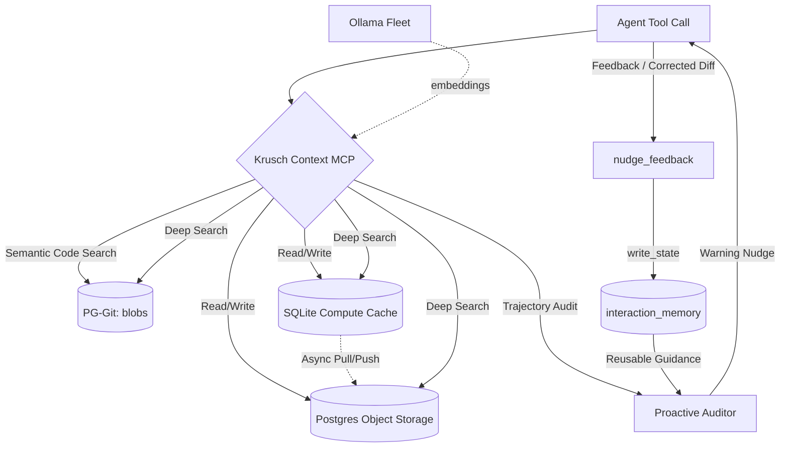

<p align="center">
  
</p>

<p align="center">
  <strong>Unified IDE context engine that merges semantic codebase search with episodic project memory into a single MCP server.</strong>
</p>

[](https://github.com/kruschdev/krusch-context-mcp)
[](https://opensource.org/licenses/MIT)


---

## The Problem

Every time you start a new AI coding session, your agent starts from zero. It doesn't remember the bug you fixed yesterday, the architectural decision you made last week, or even what files exist in your project. You end up re-explaining context, watching it hallucinate stale assumptions, and losing momentum to the "goldfish memory" problem.

**Krusch Context MCP fixes this.** It gives your AI coding agent persistent, searchable memory across every session — paired with semantic search over your entire codebase — so your agent always knows *what* your code does, *why* you built it that way, and *what went wrong last time*.

## What It Does

A single [Model Context Protocol](https://modelcontextprotocol.io/) server exposing **32 tools** to any MCP-compatible IDE agent (Cursor, Claude Code, Windsurf, Gemini CLI, etc.):

| Capability | What It Provides |
|-----------|-----------------|
| 🔍 **Semantic Codebase Search** | Search the *meaning* of your code, not just filenames. "How do we handle auth?" returns the actual implementation. |
| 🧠 **Episodic Memory** | Bugs, decisions, and lessons persist across sessions, retrieved by semantic relevance with temporal decay. See [Episodic Memory Guide](docs/EPISODIC_MEMORY.md). |
| 💎 **Steering Nudges** | Lightweight key-value facts (preferences, conventions) give the agent behavioral continuity without re-prompting. |
| 📖 **Documentation Search** | Ingested external docs are searchable locally — your agent references *your* versions, not its training data. |
| 🛡️ **Proactive Auditor (Memory Agent)** | Trajectory auditing that learns from feedback (Direct-OPD) to verify trajectories and log alignment signals. |
| 🌍 **Zero-Trust Deep Search** | One tool call cross-references codebase reality with historical memory to verify understanding before acting. |

## Why You'd Want It

**🛡️ Everything stays on your hardware** — All embeddings via local [Ollama](https://ollama.com/) (`bge-large` + `llama3.2`). Storage is PostgreSQL + pgvector + SQLite. Zero API costs, full data sovereignty.

**🔄 Switch models without losing context** — Memory is decoupled from the reasoning engine. Swap between Gemini, Claude, GPT-4o, or local models mid-project — every model inherits the same context.

**🔌 Model-Provider Agnostic & Custom Endpoints** — While Ollama is the default because it reduces installation friction to a minimum (handling automatic model fetching, dynamic VRAM loading, and dynamic model swapping out-of-the-box), the codebase is fully provider-agnostic. You can configure custom OpenAI-compatible completion or embedding endpoints (such as `llama.cpp`'s `llama-server`, LM Studio, or vLLM) by setting `COMPLETION_URL` and `EMBEDDING_URL` in your `.env`.

**⚡ One server, not three** — Codebase search, episodic memory, and steering nuggets in a single process with shared connection pool and embedding pipeline.

---

## Quick Start

**Prerequisites:** [Node.js 22+](https://nodejs.org/) · [Ollama](https://ollama.com/) with `bge-large` and `llama3.2` · PostgreSQL with [`pgvector`](https://github.com/pgvector/pgvector)

```bash
# 1. Install [PG-Git-MCP](https://github.com/kruschdev/pg-git-mcp) (codebase ingestion engine)
npm install -g pg-git-mcp

# 2. Clone and install
git clone https://github.com/kruschdev/krusch-context-mcp.git
cd krusch-context-mcp
npm install
cp .env.example .env  # Configure your database connection

# 3. Start
npm start
```

Add to your IDE MCP settings (e.g., `.cursor/mcp.json`, `claude_desktop_config.json`):

```json
{
  "mcpServers": {
    "krusch-context-mcp": {
      "command": "node",
      "args": ["/path/to/krusch-context-mcp/src/index.js"]
    }
  }
}
```

Restart your IDE — your agent now has access to all 32 tools.

> **Upgrading?** `git pull origin main && npm install && npm start` — idempotent migrations run on startup.

---

## Architecture



| Component | Details |
|-----------|---------|
| **Storage** | Hybrid: Local SQLite (per-project) + PostgreSQL (global & codebase) |
| **Embeddings** | Ollama `bge-large` @ 1024 dims, fleet load-balanced |
| **Tagging** | Ollama `llama3.2` for automatic keyword extraction |
| **Temporal Decay** | `score = similarity × e^(-0.01 × age_days)` — relevance drops ~26% after 30 days |

### Key Design Decisions

- **Lakebase Architecture** — Local SQLite for zero-latency reads, async write-behind to durable PostgreSQL. A `+0.3` local scoring bias mitigates Ebbinghaus forgetting as the global corpus grows. *Inspired by [Neon](https://neon.com/docs/introduction/architecture-overview).*
- **Hybrid Retrieval** — Auto-tagged via `llama3.2` to address pure-cosine failure modes (negation, numeric, role-swap). *Per [Sentra](https://sentra.app).*
- **Consolidation** — Semantic dedup via L2-normalized centroid averaging without re-embedding. *From [Geometry of Consolidation](https://github.com/niashwin/geometry-of-consolidation).*
- **Holographic Nuggets** — Lightweight steering facts adapted from [NeoVertex1/nuggets](https://github.com/NeoVertex1/nuggets).
- **Proactive Context Agent** — Trajectory auditor (OPD/PUST) that checks active logs against rules, records feedback alignment traces, and improves over time.

### Company Brain Substrate (v2)

Implements the three-layer organizational memory model from the [Sentra "Company Brain" research](https://sentra.app):

1. **Factual Memory** — Raw codebase state + episodic events → *"what happened"*
2. **Interaction Memory** — Parent-child UUID lineage, attribution, conflict resolution → *"why it happened"*
3. **Action Memory** — Autonomous state compilation and graph traversal → *"what to do next"*

---

## Usage Examples

### Episodic Memory

For a detailed technical guide on categories, architecture, sync mechanics, and agent lifecycle patterns, see the [Episodic Memory Guide](docs/EPISODIC_MEMORY.md).

> **You:** "That fixed the port conflict! Save this."  
> **Agent:** *[`add_memory`]* Saved to 'bugs': port 5441 conflicts with legacy DB, use 5442.

> **You:** "How did we structure the auth system?"  
> **Agent:** *[`search_memory`]* From 'lessons': chose singleton JWT factory to avoid circular dependencies.

### Granularity-Aware Search (GRASP)

`search_memory` supports deterministic GRASP parameters to dynamically adjust context depth and retrieval strategy:
* **Keyword/Tag Matches:** Bypass dense vector search to retrieve exact terms or tags:
  `search_memory({ category: "lessons", query: "JWT", search_type: "keyword" })`
* **Version Provenance Lineage:** Automatically retrieve and append the parent revision chain of the memory:
  `search_memory({ category: "priorities", query: "database", include_history: true })`
* **Codebase Edge Resolution:** Fetch and append linked git blob references (`memory_to_blob_edges`):
  `search_memory({ category: "bugs", query: "VRAM leak", include_linked_blobs: true })`

### Codebase Search

> **You:** "How does our auth middleware work?"  
> **Agent:** *[`search_code`]* Found 3 files — here's the implementation in `lib/auth.js`...

### Zero-Trust Verification

> **You:** "Before we start, verify what you know about the DB schema."  
> **Agent:** *[`deep_search`]* Cross-referencing codebase + memory — schema uses pgvector 1024 dims, last session added the `tags` column.

### Steering Nudges

> **You:** "Always use `const` over `let` in this project."  
> **Agent:** *[`nugget_remember`]* Saved: `coding-style:const-over-let`.

### Multi-Agent Conflict Resolution

> **You:** "The previous agent was wrong about the database port."  
> **Agent:** *[`resolve_conflict`]* Merged conflicting states. Deprecated old branches, created unified resolution.

### Proactive Context Auditing & Alignment Loop

> **You:** "Let's index the daily research papers using qwen2.5-coder:1.5b embeddings."  
> **Agent:** *[`proactive_nudge`]* Warning: The postgres `ide_agent_memory` table embedding column is constrained to 1024 dimensions. `qwen2.5-coder:1.5b` embeddings have 1536 dimensions and will fail. Always use `bge-large` embeddings.
>
> **Agent:** *[`nudge_feedback`]* Logs feedback indicating the warning was accepted and the trajectory was corrected. This alignment signal (Direct-OPD) is retrieved in future sessions as reusable guidance.

---

## Agent Integration Patterns

### Pattern 1: Zero-Trust Session Start

```
1. deep_search({ query: "<topic>", project: "<project>" })
   → Verify codebase + memory in one call

2. nugget_nudges({ query: "<task>", active_project: "<project>" })
   → Load conventions and preferences
```

### Pattern 2: Bug Investigation

```
1. search_memory({ category: "bugs", query: "<symptoms>" })     → Check history
2. search_code({ query: "<error>", project: "<project>" })      → Find implementation
3. [Fix the bug]
4. add_memory({ category: "bugs", content: "<root cause + fix>" }) → Document
```

### Pattern 3: Session Close

```
1. add_memory({ category: "outcomes", content: "<decisions and results>" })
2. nugget_remember({ key: "<project>:last-session", value: "<in-progress work>" })
3. consolidate({ category: "activity", project: "<project>", dry_run: true })
```

### Pattern 4: Proactive Trajectory Auditing

```
1. proactive_nudge({ history: "<conversation history window>", project: "<project>" })
   → Background threat-audit of agent trajectory against historical lessons, bugs, and rules before executing code changes
```

---

## Tool Quick-Reference

> Full parameter details, defaults, and examples → **[Tool Reference](docs/TOOL_REFERENCE.md)**

| Tool | Description |
|------|-------------|
| **Episodic Memory** | |
| `add_memory` | Store a memory (bug, lesson, priority, outcome, activity) |
| `search_memory` | Semantic search with temporal decay |
| `list_memories` | List recent memories by category |
| `delete_memory` / `update_memory` | CRUD by ID |
| `consolidate` | Merge semantically duplicate memories |
| `compile_state` | Contextmaxxing — compile full project state |
| **Company Brain v2** | |
| `write_state` | Stateful write with concurrency control and attribution |
| `resolve_conflict` | Merge conflicting sibling states |
| `get_provenance` | Trace version history and lineage |
| `search_lens` | Role-filtered semantic retrieval |
| `traverse_graph` | Navigate parent/child lineage and linked blobs |
| `update_ontology` / `link_blob` | Tag management and codebase linking |
| **Codebase Search** | |
| `search_code` | Semantic search over indexed files |
| `deep_search` | Composite zero-trust search (memory + codebase) |
| `list_repos` / `read_tree` / `read_blob` | Browse indexed repositories |
| **Nuggets** | |
| `nugget_remember` / `nugget_nudges` / `nugget_forget` / `nugget_list` | Steering fact CRUD |
| **System, Auditing, & Skills** | |
| `proactive_nudge` | Trajectory auditing — warn on rule/lesson violations |
| `nudge_feedback` | Log developer/agent feedback to record alignment signals |
| `analyze_trajectory` | Trajectory auditing — analyze execution path using STRACE and isolate faults |
| `think` | Perform context synthesis, conflict detection, and gap analysis |
| `list_skills` / `get_skill` | Browse and read specialized agent skills Registry |
| `docs_list` / `docs_search` | External documentation search |
| `health_check` | Server status verification |

---

## Project Structure

```
krusch-context-mcp/
├── src/
│   ├── index.js              # MCP server entry — tool registration & dispatch
│   ├── memory-engine.js      # Episodic memory CRUD + consolidation
│   ├── v2-engine.js          # Company Brain v2 substrate
│   ├── nuggets-engine.js     # Holographic Nuggets CRUD
│   ├── sqlite-engine.js      # Lakebase SQLite layer (pull/push sync)
│   ├── proactive-engine.js   # Proactive trajectory auditor
│   └── llm-tags.js           # Shared LLM tag generation
├── scripts/                  # Benchmarking, evaluation, and maintenance
├── tests/                    # *.test.js = automated, test_*.js = smoke
├── docs/
│   ├── TOOL_REFERENCE.md     # Full parameter reference for all 32 tools
│   ├── SETUP.md              # Configuration, storage routing, troubleshooting
│   └── research/             # Sentra Company Brain research essays
└── package.json
```

---

## Testing

```bash
npm test                                # Automated (node:test, *.test.js)
npm run test:smoke                      # JSON-RPC stdio smoke tests
node tests/test_client.js               # All 32 tools against live DB
node scripts/benchmark_latency.js       # End-to-end latency
node scripts/eval_accuracy.js           # Precision/recall
```

> **Convention:** `*.test.js` = automated tests · `test_*.js` = stdio smoke tests

---

## Related Projects

| Project | Role |
|---------|------|
| [PG-Git-MCP](https://github.com/kruschdev/pg-git-mcp) | Semantic codebase search engine (sibling dependency) |
| [Krusch Memory MCP](https://github.com/kruschdev/krusch-memory-mcp) | Legacy standalone memory (superseded) |
| [Krusch Sequential MCP](https://github.com/kruschdev/krusch-sequential-mcp) | Sequential thinking with PG persistence |
| [Krusch Cascade Router](https://github.com/kruschdev/krusch-cascade-router) | Automated LLM inference routing |
| [NeoVertex Nuggets](https://github.com/NeoVertex1/nuggets) | Original Holographic Nuggets architecture |

---

## Acknowledgments & References

This project is built upon and inspired by the following foundational research papers, architectural frameworks, and open-source projects:

### Architectural Foundations
- **Company Brain Substrate (v2)**: Core concept and multi-layered organizational memory model inspired by the [Sentra "Company Brain" Essay Series](https://sentra.app).
- **Holographic Nuggets**: Lightweight key-value steering facts adapted from the original [NeoVertex Nuggets](https://github.com/NeoVertex1/nuggets) design.
- **Lakebase Compute/Storage Decoupling**: Storage routing and local-first compute cache separation inspired by the [Neon Serverless Postgres Architecture](https://neon.tech/docs/introduction/architecture-overview).
- **Tool Tracing & Optimization**: Automated optimization of agent execution paths powered by the [HALO RLM Engine](https://github.com/context-labs/halo).

### Research Papers & Algorithms
- **Semantic Consolidation**: Centroid-based semantic memory compression without re-embedding based on the [Geometry of Consolidation repository](https://github.com/niashwin/geometry-of-consolidation).
- **Proactive Memory Agent**: Long-horizon execution warnings and memory-guided auditing based on Wu et al., [Remember When It Matters: Proactive Memory Agent for Long-Horizon Agents](https://arxiv.org/abs/2607.08716) (ArXiv: 2607.08716).
- **Direct On-Policy Distillation (Direct-OPD)**: Weak-to-strong feedback distillation for proactive context rules based on Feng et al., [Weak-to-Strong Generalization via Direct On-Policy Distillation](https://arxiv.org/abs/2607.05394) (ArXiv: 2607.05394).
- **Proxy Exploration and Reusable Guidance (PUST)**: Modular guidance paradigm using feedback traces based on Fu et al., [Proxy Exploration and Reusable Guidance: A Modular LLM Post-Training Paradigm via Proxy-Guided Update Signals](https://arxiv.org/abs/2607.11505) (ArXiv: 2607.11505).
- **Granularity-Aware Search Policy (GRASP)**: Dynamic context depth expansion for search queries based on Gandhi et al., [GRASP: GRanularity-Aware Search Policy for Agentic RAG](https://arxiv.org/abs/2607.10463) (ArXiv: 2607.10463).

## Contributing

We welcome contributions! Please ensure tests pass and adhere to the project formatting standards.

## License

MIT License © 2026 [kruschdev](https://github.com/kruschdev)
