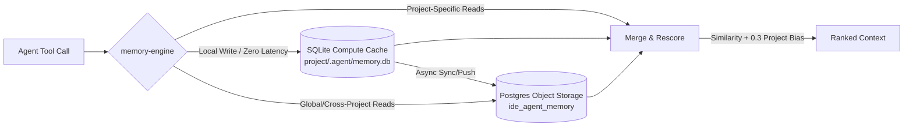

# 🧠 Episodic Memory in Krusch Context MCP

> Overcoming the agent "goldfish memory" problem by providing a persistent, semantically-searchable project history with temporal decay and local-compute performance.

---

## 1. The Core Concept

Every time an AI agent starts a new session (e.g., in Claude Code, Cursor, or a terminal agent), its context is empty. It has no memory of:
- The bug you found and resolved yesterday.
- The architectural decisions made last week.
- The next steps in the pipeline that are partially implemented.

**Episodic Memory** provides this memory substrate. It records short-term and long-term project events, priorities, learnings, and errors. The agent reads this memory at the start of a session and updates it as work progresses, ensuring continuous trajectory tracking without bloating the LLM prompt context window.

---

## 2. Technical Architecture & Lakebase Flow

Episodic memory uses a decoupled **Lakebase Architecture** to balance zero-latency local agent execution with global database persistence.



### Compute vs. Storage Layers
1. **Compute Cache (Local SQLite):**
   - Stored in `<project-root>/.agent/memory.db`.
   - Zero-latency reads and writes for project-specific operations.
   - Resilient to network disruptions and PostgreSQL latency spikes.
2. **Object Storage (PostgreSQL):**
   - Stored in `kruschdb` inside the `ide_agent_memory` table.
   - Serves as the fleet-wide, durable persistent store.
   - Allows cross-project searching and central backup.

### Sync Pipeline (SQLite ↔ Postgres)
- **Pull Sync (Postgres → SQLite):** Happens on the first tool access for a project. It pulls all episodic memories matching the project name from Postgres into the local SQLite database.
- **Push Sync (SQLite → Postgres):** Whenever a memory is added/updated in the local SQLite cache, an async write-behind process pushes the changes to PostgreSQL.

---

## 3. Embeddings & Hybrid Auto-Tagging

To enable semantic search, every memory must be vectorized.

- **Embedding Vector:** All memories are embedded using the `bge-large` model (1024 dimensions) dispatched via a shared, fleet load-balanced Ollama queue.
- **Hybrid Keyword/Tag Extraction:** Pure cosine similarity can suffer from failure modes on exact search terms (like specific ports or numeric constants) or negated concepts. To prevent this, every memory is processed by `llama3.2` to extract key topics and tags.
- **Storage:** Tags are stored as a JSON array (`tags` column) alongside the content and vector embedding, enabling both semantic vector search and exact keyword/tag filters.

---

## 4. Relevance, Temporal Decay, and Project Bias

Memory retrieval does not just return the closest vector match; it runs a scoring algorithm designed to mirror human cognitive decay (the Ebbinghaus Forgetting Curve) and project-local focus.

### The Scoring Formula
$$Score = (Similarity + ProjectBias) \times e^{-0.01 \times AgeInDays}$$

### Key Scoring Factors
1. **Cosine Similarity:** The base cosine similarity of the query vector and the memory embedding.
2. **Project-Local Bias:** If searching from a project folder, project-specific SQLite memories receive a `+0.3` boost. This ensures that a memory about a port configuration in the *current* project is prioritized over a similar configuration memory in a *different* project.
3. **Temporal Decay:** Relevance decays exponentially over time at a rate of 1% per day (relevance drops by ~26% after 30 days of inactivity). This keeps stale memories from cluttering active focus while keeping recent work at high priority.

---

## 5. Memory Categories

To prevent semantic cross-contamination (e.g., a bug memory polluting a list of goals), episodic memories are divided into five distinct categories:

| Category | Description / Purpose | Example Content |
|---|---|---|
| 📌 **`priorities`** | Active goals, roadmap, task state, and milestones. | `Implement SQLite pull/push sync engine for Krusch Context.` |
| 🐛 **`bugs`** | Identified issues, root causes, symptoms, and fixes. | `Port 5441 conflicts with PostgreSQL. Switched container to 5442.` |
| 🎯 **`outcomes`** | Results of completed sessions, deployments, or tests. | `Verified all 32 tools pass smoke tests on kruschserv.` |
| 🎓 **`lessons`** | Pattern discoveries, architectural decisions, and conventions. | `Avoid circular imports in index.js by exporting DB pools from pool.js.` |
| 🕒 **`activity`** | Chronological log of steps taken during the session. | `Created test suite, migrated schema, verified connections.` |

---

## 6. How We Use Episodic Memory (Agent Workflows)

IDE agents should proactively integrate episodic memory into their lifecycle.

### Workflow 1: Zero-Trust Session Start
When you begin a task, the agent runs a composite search to review recent memory and verify it matches the active codebase:
```javascript
// Step 1: Query database using zero-trust deep search
krusch_context_deep_search({
  query: "implement sqlite syncing",
  project: "krusch-context-mcp"
});

// Step 2: Retrieve active priorities and outcomes
krusch_context_list_memories({
  category: "priorities",
  project: "krusch-context-mcp",
  limit: 5
});
```

### Workflow 2: Logging Discoveries & Resolutions
Whenever a bug is fixed or a design decision is reached, document it immediately to preserve context:
```javascript
krusch_context_add_memory({
  category: "bugs",
  project: "krusch-context-mcp",
  content: "Identified a VRAM leak when embedding large codebase folders. Mitigated by switching completion/embedding models to a fleet load-balanced Ollama pipeline with active concurrency limits."
});
```

### Workflow 3: Session Close
When pausing or ending a development session, the agent logs a summary of outcomes and activity to bridge the gap to the next session:
```javascript
// 1. Add session outcome
krusch_context_add_memory({
  category: "outcomes",
  project: "krusch-context-mcp",
  content: "Completed implementation of Lakebase SQLite compute cache. All integration tests passing. Pending deployment to kruschgame node."
});

// 2. Add activity summary
krusch_context_add_memory({
  category: "activity",
  project: "krusch-context-mcp",
  content: "Refactored sqlite-engine.js to support push/pull. Updated index.js to hook into the startup lifecycle. Created lakebase.test.js."
});
```

### Workflow 4: Semantic Consolidation
Over time, adding memories can create redundant or overlapping records. The server provides a semantic consolidation engine that merges matching memories by calculating their centroid average:
```javascript
krusch_context_consolidate({
  category: "lessons",
  project: "krusch-context-mcp",
  threshold: 0.88,
  dry_run: false
});
```
This reduces noise in the memory footprint without losing historical provenance.

---

## 7. References & Acknowledgments

This project is built upon and inspired by the following foundational research papers, architectural frameworks, and open-source projects:

### Architectural Foundations
- **Company Brain Substrate (v2)**: Core concept and multi-layered organizational memory model inspired by the [Sentra "Company Brain" Essay Series](https://sentra.app).
- **Holographic Nuggets**: Lightweight key-value steering facts adapted from the original [NeoVertex Nuggets](https://github.com/NeoVertex1/nuggets) design.
- **Lakebase Compute/Storage Decoupling**: Storage routing and local-first compute cache separation inspired by the [Neon Serverless Postgres Architecture](https://neon.tech/docs/introduction/architecture-overview).
- **Tool Tracing & Optimization**: Automated optimization of agent execution paths powered by the [HALO RLM Engine](https://github.com/context-labs/halo).

### Research Papers & Algorithms
- **Semantic Consolidation**: Centroid-based semantic memory compression without re-embedding based on the [Geometry of Consolidation repository](https://github.com/niashwin/geometry-of-consolidation).
- **Proactive Memory Agent**: Long-horizon execution warnings and memory-guided auditing based on Wu et al., [Remember When It Matters: Proactive Memory Agent for Long-Horizon Agents](https://arxiv.org/abs/2607.08716) (ArXiv: 2607.08716).
- **Direct On-Policy Distillation (Direct-OPD)**: Weak-to-strong feedback distillation for proactive context rules based on Feng et al., [Weak-to-Strong Generalization via Direct On-Policy Distillation](https://arxiv.org/abs/2607.05394) (ArXiv: 2607.05394).
- **Proxy Exploration and Reusable Guidance (PUST)**: Modular guidance paradigm using feedback traces based on Fu et al., [Proxy Exploration and Reusable Guidance: A Modular LLM Post-Training Paradigm via Proxy-Guided Update Signals](https://arxiv.org/abs/2607.11505) (ArXiv: 2607.11505).
- **Granularity-Aware Search Policy (GRASP)**: Dynamic context depth expansion for search queries based on Gandhi et al., [GRASP: GRanularity-Aware Search Policy for Agentic RAG](https://arxiv.org/abs/2607.10463) (ArXiv: 2607.10463).
