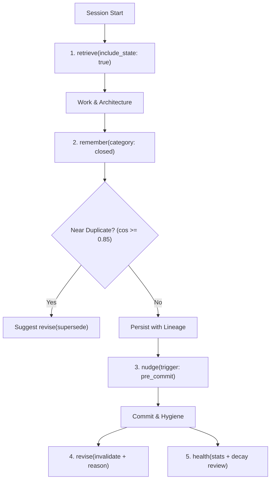

# 🧠 What Makes `krusch-context-mcp` Special

> **Author**: Kevin (`kruschdev`)  
> **Version**: v1.8.0  
> **Category**: `#AI` `#MCP` `#DeveloperTools` `#AgentArchitecture` `#SQLite` `#NodeJS`


> 💡 **Social Caption**:  
> *Most agent memory tools dump unstructured notes into a flat vector bag and rot within a week. What makes krusch-context-mcp v1.8.0 special? A radical 5-verb contract, closed taxonomy, temporal lineage, zero-Docker SQLite, and pre-commit invariant steering.*

---

## 1. The Core Problem: The "Goldfish Agent" and the Bag of Notes

AI coding assistants (Cursor, Claude Code, Windsurf, Codex) are brilliant in short bursts, but they suffer from **cross-session amnesia**:
1. **Goldfish Sessions**: Every turn or prompt restart forgets why architectural compromises were made.
2. **Zombie Regressions**: A bug diagnosed and patched three days ago is reintroduced because the agent forgot the root cause.
3. **Convention Amnesia**: Critical invariants (*"Never use raw SQL queries without parameterized bindings"*, *"Always return RFC 7807 error envelopes"*) must be repeatedly re-explained.

### The Naive Solution That Fails: The "Bag of Notes"
Most memory MCP servers attempt to solve this by creating an unbounded vector store where the agent writes random unconstrained notes (`remember("User prefers red buttons")`).

Within a week, this breaks down:
* **Memory Rot**: A note from two months ago (*"Use temporary in-memory mock"*) contradicts current production architecture (*"Use PostgreSQL"*) and poisons the agent's context.
* **Tool Soup**: Servers exposing 15 to 60+ tools overwhelm the LLM's context window with tool schemas, causing frequent hallucinated parameters and degraded reasoning.
* **No Accounting for Change**: When a decision changes, naive stores either overwrite history blindly (destroying context) or let contradictory notes coexist without explanation.

---

## 2. What Makes `krusch-context-mcp` Special in v1.8.0

`krusch-context-mcp` rejects the flat note-bag pattern. Instead, it treats agent memory as a **structured, governed lifecycle**:



---

### Pillar 1: The 5-Verb Discipline (Eliminating Tool Soup)

Most MCP servers suffer from bloated tool definitions. Exposing dozens of tools costs 3,000+ tokens *on every turn* and confuses the agent.

`krusch-context-mcp` enforces a tight, ergonomic surface of **strictly five canonical verbs**:

| Verb | Tool Name | Purpose |
| :--- | :--- | :--- |
| **`retrieve`** | `krusch_context_retrieve` | Hydrate working context & state briefings within an exact token budget. |
| **`remember`** | `krusch_context_remember` | Store lasting decisions or key-value steering nuggets with near-dup guards. |
| **`revise`** | `krusch_context_revise` | Supersede old decisions with lineage links, or invalidate with mandatory justification. |
| **`nudge`** | `krusch_context_nudge` | Audit code diffs against recorded invariants before committing (max 1–3 findings). |
| **`health`** | `krusch_context_health` | Inspect taxonomy breakdown, storage mode, and review memories older than 30 days. |

*Result*: Tool schema footprint is reduced from ~3,500 tokens to **~350 tokens**. Host agents call the right tool with near-100% precision.

---

### Pillar 2: The Closed Write Taxonomy

Unconstrained text dumps quickly degenerate into garbage. `krusch-context-mcp` requires every memory to declare a valid category from a closed taxonomy:

* **`decision`**: Architectural commitments and trade-offs (*"Standardized on node:sqlite built-in over better-sqlite3"*).
* **`invariant`**: Non-negotiable code rules enforced during pre-commit (*"All HTTP API errors must use RFC 7807 envelopes"*).
* **`bug`**: Diagnosed root causes and anti-regression rules (*"WAL checkpoint deadlock occurs when concurrent writer runs without mutex"*).
* **`lesson`**: Framework discoveries and operational quirks (*"Vite 5 requires ESM output when targeting Node 22"*).
* **`blocker`**: External dependencies or pending upstream migrations.

Because every entry is classified, `retrieve({ include_state: true })` can instantly construct an organized project briefing in a single turn.

---

### Pillar 3: Temporal Lineage & Audited Invalidation

When architectural decisions evolve, naive systems overwrite or leave stale twins. `krusch-context-mcp` maintains an explicit temporal lineage:

1. **Near-Duplicate Warning**: When calling `remember`, if a new memory matches an existing record (`cosine >= 0.85`), the server warns the agent and returns the candidate ID:
   ```json
   {
     "warning": "near_duplicate",
     "candidate_id": 14,
     "suggestion": "Call revise with action 'supersede' if updating this knowledge."
   }
   ```
2. **Superseding**: Calling `revise(action: 'supersede', target_id: 14)` marks the previous record `SUPERSEDED` and records `supersedes_id: 14` on the new record. Active queries only see the latest truth, but historical lineage is preserved.
3. **Mandatory Invalidation Justification**: When retiring a rule or invariant, `revise(action: 'invalidate')` strictly rejects empty reasons:
   ```json
   {
     "action": "invalidate",
     "target_id": 8,
     "reason": "Replaced manual mutex with atomic SQLite transactions in v1.8."
   }
   ```
   Agents can inspect *why* a historical rule was deprecated, preventing teams from repeating past debates.

---

### Pillar 4: Token-Budgeted State Packing

Agents operate under finite context budgets. Asking an agent to read a sprawling memory store causes prompt overflow.

`krusch_context_retrieve` accepts a `limit_tokens` budget (default: 4,000 tokens) and performs greedy pack reranking:
1. Active Project Invariants (highest priority)
2. Unresolved Blockers & Recent Decisions
3. Ranked Semantic Matches
4. Decay Candidates (>30 days old) flagged for review

In one turn at session start, the agent is fully grounded in the project's living context without wasting tokens.

---

### Pillar 5: Zero-Docker, Zero-Native-Compilation Local First

`krusch-context-mcp` requires **zero Docker containers, zero external database setup, and zero native compilation** (`better-sqlite3`, `ml-pca`, and `@opentelemetry/*` were eliminated):

* **Native Node 22 SQLite**: Leverages built-in `node:sqlite` (`DatabaseSync`) to persist data to `.agent/context.db` right next to your repository.
* **Instant Setup**:
  ```bash
  npx krusch-context-mcp init
  ```
  Initializes `.agent/context.db`, configures `.env`, seeds the starter project invariant, installs `AGENTS.md`, and prints copy-paste configurations for Cursor and Claude Code in under 5 seconds.
* **Operational Honesty**: If an Ollama embedding daemon is available, it uses vector similarity (`bge-large` @ 1024-d). If no embedding service is running, it seamlessly falls back to deterministic lexical search, recency scoring, and tag indexing without crashing.
* **Optional Fleet Adapter**: For multi-machine homelab fleets, setting `STORAGE_MODE=postgres` connects to PostgreSQL + `pgvector` with zero code changes.

---

## 3. Why Was Codebase RAG Separated Into `krusch-git`?

Earlier versions of `krusch-context-mcp` attempted to bundle everything into a single package: AST code parsing, Git commit DAG traversal, symbol call graphs, external documentation, and decision memory.

In v1.8.0, **Codebase RAG was decoupled into [krusch-git](https://github.com/kruschdev/krusch-git)** (`krusch-git@1.2.1`).

### The Architectural Rationale:
1. **Divergent Lifecycles**:
   - **Code Structure (`krusch-git`)** changes with every git commit, branch checkout, or file edit. It requires AST parsers, commit graph walkers, and symbol edge extractors.
   - **Decision Memory (`krusch-context-mcp`)** changes with human/agent architectural commitments, debugging discoveries, and policy shifts.
2. **Preventing Agent Confusion**:
   Combining code search (`search_code`, `search_symbols`, `symbol_graph`) with memory verbs in the same MCP tool table led agents to call code search when they needed memory, or vice versa.
3. **The Sibling Synergy**:
   - Use **`krusch-context-mcp`** (Tier 1) for **Agent Steering & Episodic Memory** (why code was written).
   - Use **`krusch-git`** (Tier 2) for **Git DAG & Symbol Traversal** (how code is structured).
   - Use **`krusch-harness`** (Tier 3) for **Staged Execution & Verification** (how code is safely committed).

### The 7 Canonical Tools of `krusch-git`:
| Tool | Purpose |
|---|---|
| `krusch_git_list_repos` | List all indexed repositories & branch metadata |
| `krusch_git_read_tree` | Inspect Git DAG tree hierarchy at commit/branch |
| `krusch_git_read_blob` | Fetch content-addressed file blob or pointer file |
| `krusch_git_semantic_search` | Hybrid cosine + BM25 + temporal recency decay ($e^{-0.01t}$) |
| `krusch_git_search_symbols` | AST lookup for functions, classes, and interfaces |
| `krusch_git_file_symbols` | Line-range symbol map for a specific file |
| `krusch_git_dependency_graph` | Multi-hop caller/callee traversal around target symbol |

---

### The 3-Tier Coding Agent MCP Ecosystem

```
┌─────────────────────────────────────────────────────────────┐
│ 1. SESSION START & INVARIANTS                               │
│    krusch-context-mcp: retrieve, remember, revise, nudge     │
└──────────────────────────────┬──────────────────────────────┘
                               │
                               ▼
┌─────────────────────────────────────────────────────────────┐
│ 2. CODE EXPLORATION & ARCHITECTURE                          │
│    krusch-git: search_symbols, dependency_graph, read_blob   │
└──────────────────────────────┬──────────────────────────────┘
                               │
                               ▼
┌─────────────────────────────────────────────────────────────┐
│ 3. STAGED EXECUTION & VERIFICATION                          │
│    krusch-harness: run, task_status, diff, apply_diff        │
└─────────────────────────────────────────────────────────────┘
```

---

## 4. Feature Comparison: The Evolution

| Capability | Generic Vector DB | Naive MCP Memory | krusch-context-mcp v1.8.0 |
| :--- | :---: | :---: | :---: |
| **Tool Count** | REST APIs / 10+ | 8–20 tools | **Strictly 5 Canonical Verbs** (~350 schema tokens) |
| **Write Model** | Raw vectors | Unbounded strings | **Closed Taxonomy** (`decision`, `invariant`, `bug`, etc.) |
| **Memory Lineage** | ❌ None | ❌ Overwrite | **✅ Supersede pointers + mandatory invalidation reason** |
| **Near-Duplicate Guard** | ❌ None | ❌ None | **✅ Cosine >= 0.85 warning + candidate suggestion** |
| **Pre-Commit Audit** | ❌ None | ❌ None | **✅ `nudge` diff check (max 1–3 high-signal findings)** |
| **Local Dependencies** | Docker / SaaS | better-sqlite3 / native build | **✅ Node 22 native `node:sqlite` (zero compilation)** |
| **Embeddings Fallback** | Hard crash | None | **✅ Graceful degradation to lexical + recency** |
| **Agent Protocol Enforcement** | Manual prompt | Manual prompt | **✅ Automated `AGENTS.md` installer in `init`** |

---

## 5. Quickstart

Get persistent, self-governing memory in any repository:

```bash
# In your project repository:
npx krusch-context-mcp init
```

Add to your **Cursor** (`.cursor/mcp.json`):
```json
{
  "mcpServers": {
    "krusch-context": {
      "command": "npx",
      "args": ["-y", "krusch-context-mcp"]
    }
  }
}
```

Or **Claude Code**:
```bash
claude mcp add krusch-context npx krusch-context-mcp
```

Your agent will automatically read `AGENTS.md`, hydrate its state with `retrieve`, record enduring lessons with `remember`, audit diffs with `nudge`, and keep context pristine.
